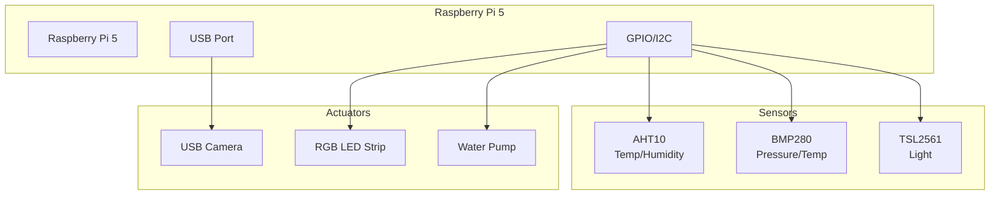
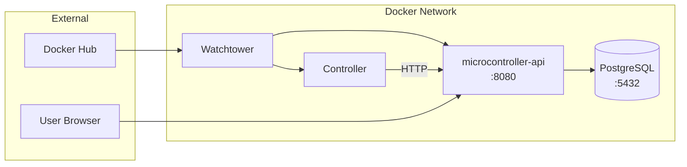
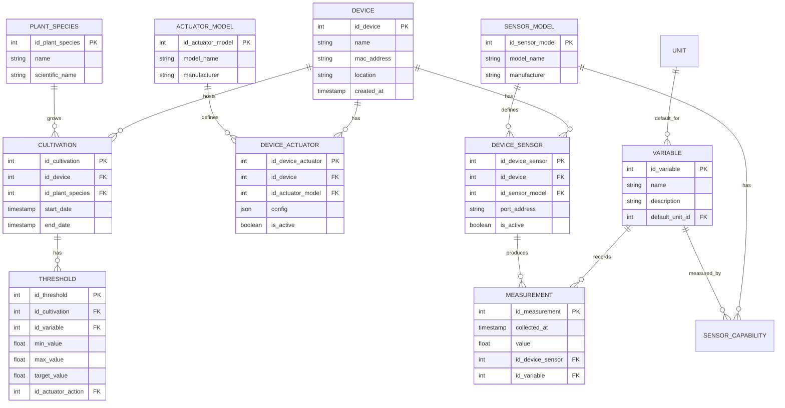
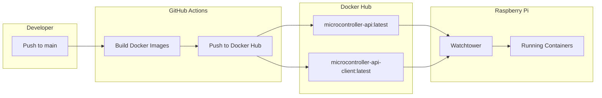
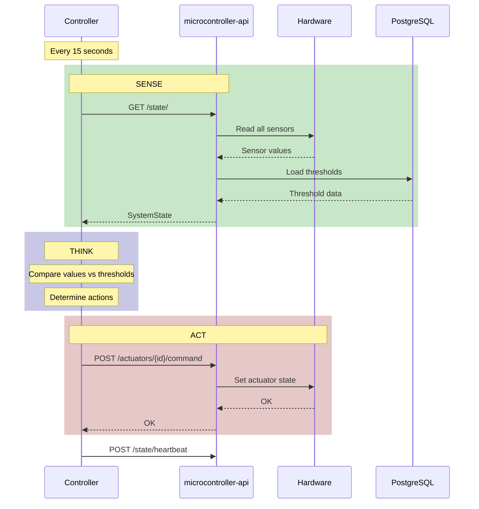
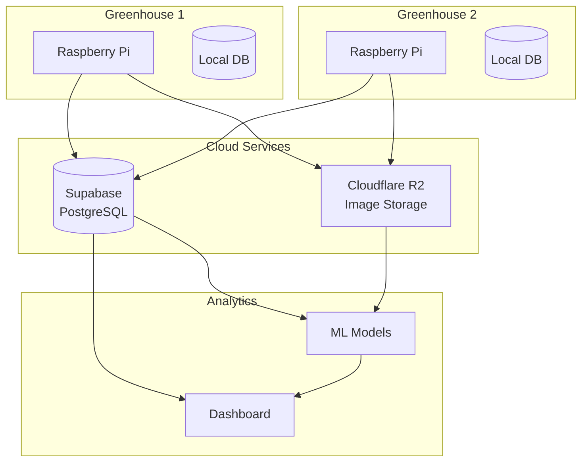

# System Diagrams

Visual representations of the GreenThumb system architecture.

## Hardware Setup

## Docker Services

## Database Schema

## CI/CD Pipeline

## Control Loop (Sense-Think-Act)

## Future: Cloud Integration

