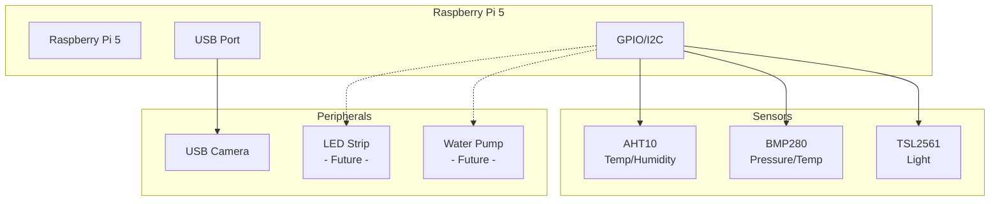
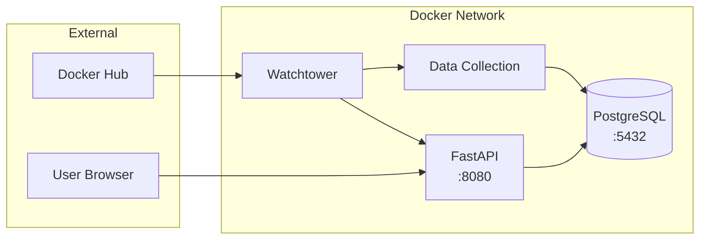
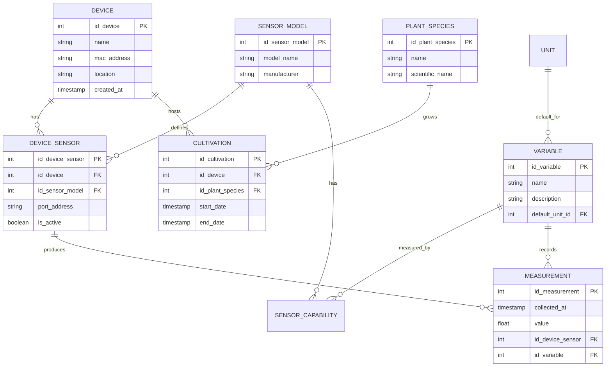
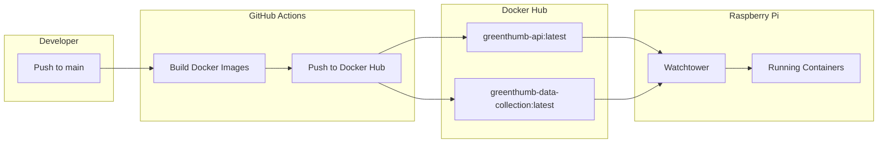
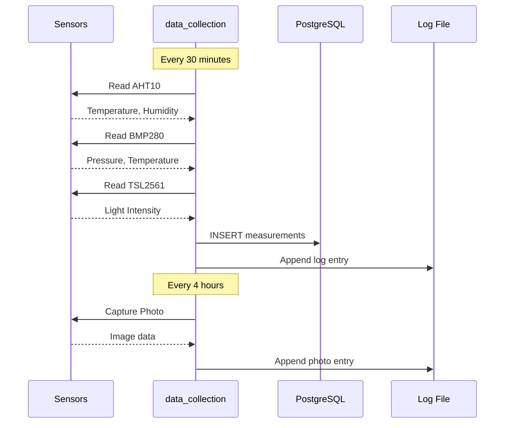
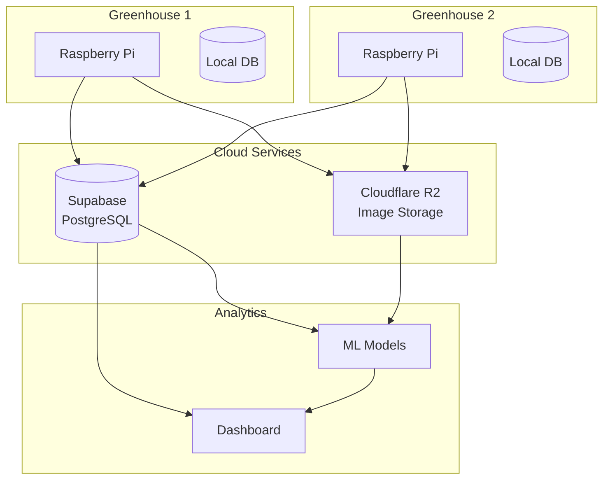

# System Diagrams

Visual representations of the GreenThumb system architecture.

## Hardware Setup

## Docker Services

## Database Schema

## CI/CD Pipeline

## Data Collection Flow

## Future: Cloud Integration

