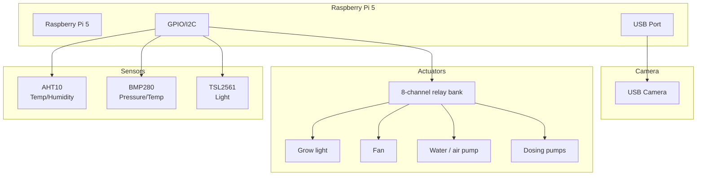
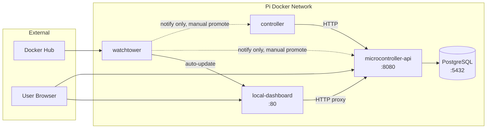
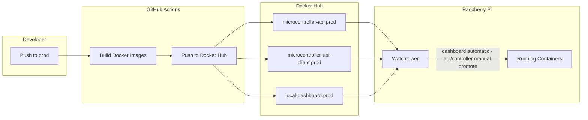
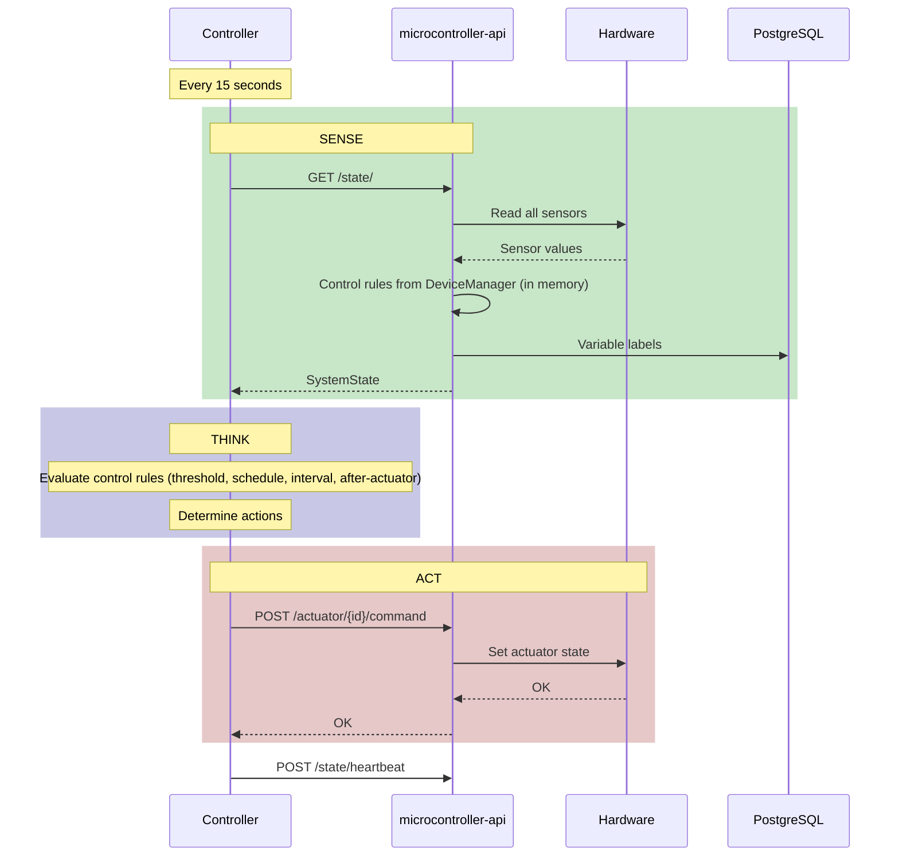
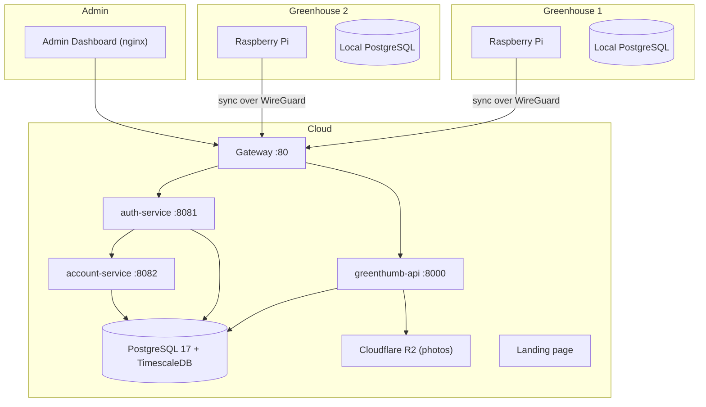

# System Diagrams

Visual representations of the GreenThumb system architecture.

## Hardware Setup

```mermaid
graph TB
    subgraph "Raspberry Pi 5"
        RPI[Raspberry Pi 5]
        GPIO[GPIO/I2C]
        USB[USB Port]
    end
    
    subgraph "Sensors"
        AHT[AHT10<br/>Temp/Humidity]
        BMP[BMP280<br/>Pressure/Temp]
        TSL[TSL2561<br/>Light]
    end
    
    subgraph "Camera"
        CAM[USB Camera]
    end
    
    subgraph "Actuators"
        RELAY[8-channel relay bank]
        LIGHT[Grow light]
        FAN[Fan]
        PUMP["Water / air pump"]
        DOSE[Dosing pumps]
    end
    
    GPIO --> AHT
    GPIO --> BMP
    GPIO --> TSL
    USB --> CAM
    GPIO --> RELAY
    RELAY --> LIGHT
    RELAY --> FAN
    RELAY --> PUMP
    RELAY --> DOSE
```

## Docker Services

```mermaid
graph LR
    subgraph "Pi Docker Network"
        DB[(PostgreSQL\n:5432)]
        API[microcontroller-api\n:8080]
        CTRL[controller]
        DASH[local-dashboard\n:80]
        WT[watchtower]
    end

    subgraph "External"
        DH[Docker Hub]
        BROWSER[User Browser]
    end

    CTRL -->|HTTP| API
    DASH -->|HTTP proxy| API
    API --> DB
    BROWSER --> DASH
    BROWSER --> API
    DH --> WT
    WT -->|auto-update| DASH
    WT -.->|"notify only, manual promote"| API
    WT -.->|"notify only, manual promote"| CTRL
```

## Database Schema

The schema is described on the [Database](../components/database.md) page; the source of truth is the `database` repository.

## CI/CD Pipeline

```mermaid
graph LR
    subgraph "Developer"
        DEV[Push to prod]
    end
    
    subgraph "GitHub Actions"
        BUILD[Build Docker Images]
        PUSH[Push to Docker Hub]
    end
    
    subgraph "Docker Hub"
        API_IMG["microcontroller-api:prod"]
        CTRL_IMG["microcontroller-api-client:prod"]
        DASH_IMG["local-dashboard:prod"]
    end
    
    subgraph "Raspberry Pi"
        WT[Watchtower]
        CONTAINERS[Running Containers]
    end
    
    DEV --> BUILD
    BUILD --> PUSH
    PUSH --> API_IMG
    PUSH --> CTRL_IMG
    PUSH --> DASH_IMG
    API_IMG --> WT
    CTRL_IMG --> WT
    DASH_IMG --> WT
    WT -->|"dashboard automatic · api/controller manual promote"| CONTAINERS
```

The cloud stack follows the same flow (its own workflow, push to `prod`).

## Control Loop (Sense-Think-Act)

```mermaid
sequenceDiagram
    participant CTRL as Controller
    participant API as microcontroller-api
    participant HW as Hardware
    participant DB as PostgreSQL
    
    Note over CTRL: Every 15 seconds
    
    rect rgb(200, 230, 200)
        Note over CTRL,API: SENSE
        CTRL->>API: GET /state/
        API->>HW: Read all sensors
        HW-->>API: Sensor values
        API->>API: Control rules from DeviceManager (in memory)
        API->>DB: Variable labels
        API-->>CTRL: SystemState
    end
    
    rect rgb(200, 200, 230)
        Note over CTRL: THINK
        Note over CTRL: Evaluate control rules (threshold, schedule, interval, after-actuator)
        Note over CTRL: Determine actions
    end
    
    rect rgb(230, 200, 200)
        Note over CTRL,HW: ACT
        CTRL->>API: POST /actuator/{id}/command
        API->>HW: Set actuator state
        HW-->>API: OK
        API-->>CTRL: OK
    end
    
    CTRL->>API: POST /state/heartbeat
```

## Cloud Integration

Each Pi node syncs to the cloud API over the WireGuard VPN. The cloud runs a self-hosted PostgreSQL 17 + TimescaleDB instance for the fleet database, and Cloudflare R2 for photos.

```mermaid
graph TB
    subgraph "Greenhouse 1"
        RPI1[Raspberry Pi]
        DB1[(Local PostgreSQL)]
    end

    subgraph "Greenhouse 2"
        RPI2[Raspberry Pi]
        DB2[(Local PostgreSQL)]
    end

    subgraph "Cloud"
        GW[Gateway :80]
        GAPI[greenthumb-api :8000]
        AUTH[auth-service :8081]
        ACC[account-service :8082]
        SUPDB[(PostgreSQL 17 + TimescaleDB)]
        SUPSTORAGE["Cloudflare R2 (photos)"]
        LANDING[Landing page]
    end

    subgraph "Admin"
        ADMINDASH["Admin Dashboard (nginx)"]
    end

    RPI1 -->|sync over WireGuard| GW
    RPI2 -->|sync over WireGuard| GW
    GW --> GAPI
    GW --> AUTH
    AUTH --> ACC
    GAPI --> SUPDB
    GAPI --> SUPSTORAGE
    AUTH --> SUPDB
    ACC --> SUPDB
    ADMINDASH --> GW
```

The admin dashboard and API are not public yet; only the landing page is.

Sync is best-effort and offline-safe: the Pi queues unsynced rows locally and pushes them when connectivity is restored.
