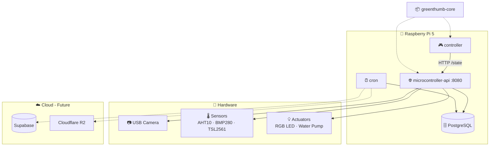
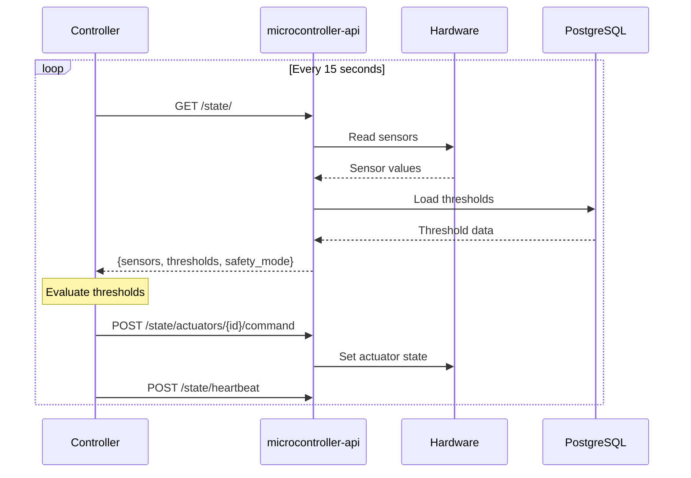
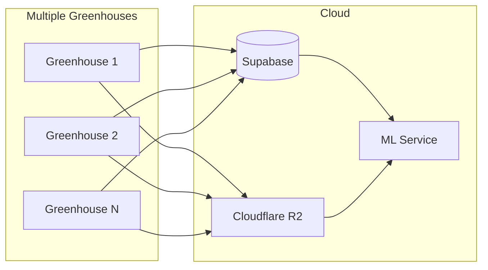

# Architecture Overview

GreenThumb uses a multi-repository, microservices architecture deployed on a Raspberry Pi 5, designed for horizontal scalability across multiple cultivation nodes.

## System Diagram

## Remote Access

### Current Setup: Tailscale VPN

The Raspberry Pi runs [Tailscale](https://tailscale.com) to provide:

- **Always-on IP address** - Access the Pi from anywhere without port forwarding
- **Secure development** - SSH and dashboard access from any location
- **CI/CD integration** - Deploy updates remotely via GitHub Actions

See [Tailscale Setup](../getting-started/tailscale-setup.md) for configuration details.

### Future Vision

For end users, we plan to enable remote greenhouse access without requiring VPN knowledge:

- Client accesses their greenhouse via web dashboard
- System handles secure connectivity transparently
- No Tailscale or VPN configuration needed by the user

## Services

### Microcontroller API

The `microcontroller-api` service is the central hub that:

- Manages all hardware (sensors and actuators)
- Provides REST API endpoints for data access
- Serves live video streaming from the camera
- Hosts the static dashboard
- Implements per-actuator locking for concurrent access

### Controller

The `controller` service (from `microcontroller-api-client` repo) implements the Sense-Think-Act loop:

- **Sense**: Fetches system state from `/state/` endpoint
- **Think**: Evaluates thresholds and determines actions
- **Act**: Commands actuators via `/state/actuators/{id}/command`
- **Heartbeat**: Signals liveness to prevent safety mode

This separation allows future replacement with ML agents.

### PostgreSQL

Local database storing:

- Device and sensor configurations
- Actuator definitions and states
- Plant species catalog
- Measurement history
- Cultivation records and thresholds

### Cron (Optional)

Scheduled tasks for:

- Cloud database sync (future)
- Local database cleanup
- Backup operations

## Data Flow

## Technology Decisions

| Decision | Choice | Rationale |
|----------|--------|-----------|
| Controller | Raspberry Pi 5 | Powerful, runs Linux, Python support |
| Database | PostgreSQL | Robust, good for time-series data |
| ORM | SQLModel | Combines Pydantic + SQLAlchemy |
| Containers | Docker | Easy deployment, reproducibility |
| CI/CD | GitHub Actions | Automatic builds on push |
| Remote Access | Tailscale | Secure, easy VPN for development |
| Architecture | API-as-Device-Manager | Centralized hardware control, future ML agent support |

## Future Architecture

