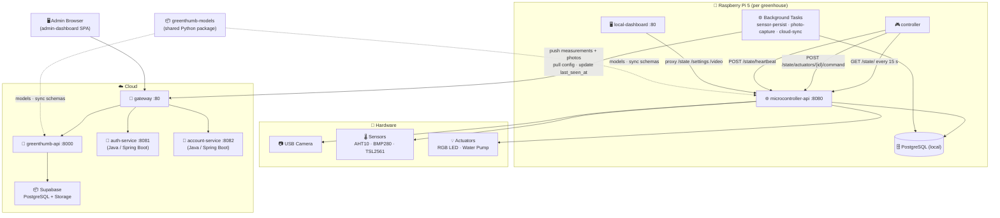
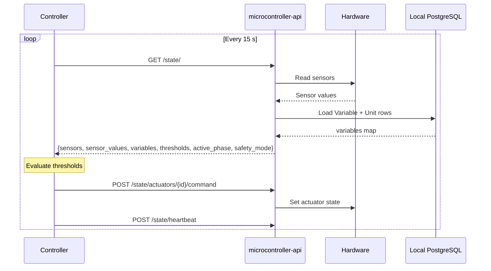
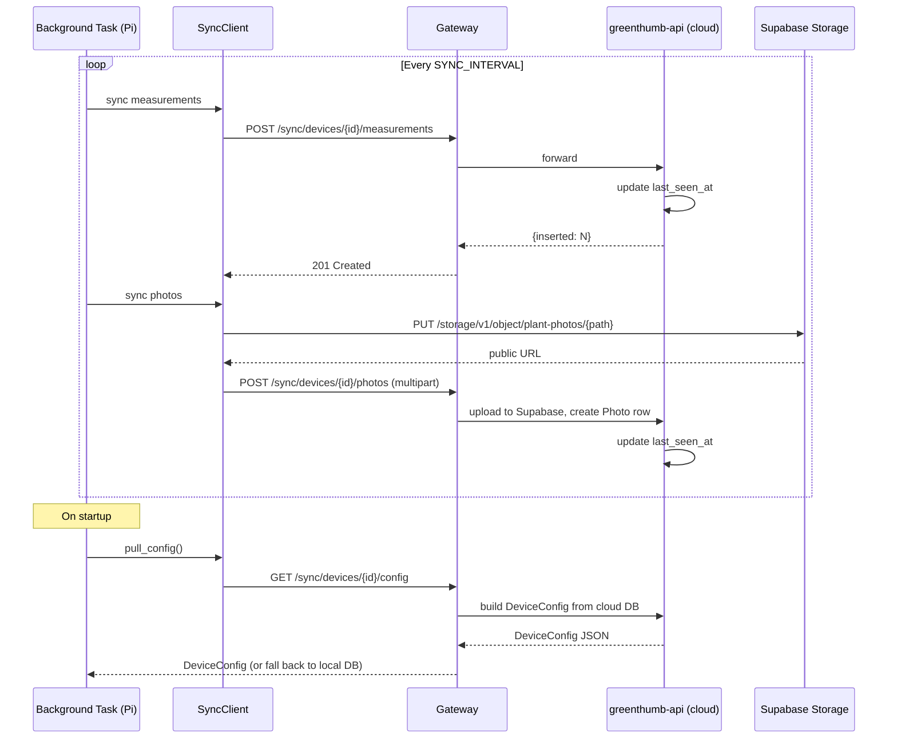

# Architecture Overview

GreenThumb is a **Cloud + Pi hybrid** system: one or more Raspberry Pi 5 nodes each run a fully self-contained greenhouse controller (local database, API, hardware drivers, local dashboard), while a shared cloud backend aggregates data, manages identity, and allows remote administration across the fleet.

## System Diagram

## Two Tiers of Storage

| Location | Database | Purpose |
|----------|----------|---------|
| **Pi-local** | PostgreSQL (inside Docker) | Real-time readings, actuator state, local thresholds, photo metadata |
| **Cloud** | Supabase PostgreSQL | Fleet-wide history, aggregated measurements, user accounts, device registry |

Data flows **Pi → Cloud** on every sync cycle. Configuration flows **Cloud → Pi** on startup (with local DB as fallback).

## Package Architecture

The Python codebase is split into two installable packages and one compatibility shim:

| Package | Location | Contents |
|---------|----------|---------|
| `greenthumb-models` | `rasp5/greenthumb-models/` | SQLModel table definitions, Pydantic DTOs, sync schemas — imported by **both** the Pi API and the cloud API |
| `greenthumb-rpi5` | `rasp5/greenthumb-rpi5/` | Hardware drivers (sensors, actuators, camera), DeviceManager — Pi only |
| `greenthumb-core` | `rasp5/greenthumb-core/` | Thin compatibility re-export of the above two packages |

## Services

### Raspberry Pi (per device)

| Service | Port | Role |
|---------|------|------|
| `api` (microcontroller-api) | 8080 | Hardware control, REST API, MJPEG stream |
| `controller` | — | Sense-Think-Act loop every 15 s |
| `local-dashboard` | 80 | React SPA served by nginx, proxied to api |
| `db` | 5432 (internal) | Local PostgreSQL |
| `watchtower` | — | Auto-pulls updated Docker images |

Three **asyncio background tasks** run inside the API process:

- **sensor-persist** — Reads all sensors, writes `Measurement` rows every `SENSOR_INTERVAL` (default 300 s)
- **photo-capture** — Captures and locally stores a photo every `PHOTO_INTERVAL` (default 4 h), attempts immediate upload
- **cloud-sync** — Pushes unsynced measurements and photos, pulls latest device config, updates `last_seen_at`, every `SYNC_INTERVAL` (default 86400 s)

### Cloud

| Service | Port | Role |
|---------|------|------|
| `gateway` | 80 | Spring Cloud Gateway — routes `/admin/**` and `/sync/**` → greenthumb-api, `/auth/**` → auth-service, `/accounts/**` → account-service |
| `greenthumb-api` | 8000 | FastAPI — admin CRUD + Pi sync endpoints |
| `auth-service` | 8081 | Java Spring Boot — JWT login & validation |
| `account-service` | 8082 | Java Spring Boot — user account management |

The **admin-dashboard** React SPA is built separately (see `cloud/admin-dashboard/`) and deployed independently of the Docker Compose stack.

## Authentication Model

| Actor | Mechanism |
|-------|-----------|
| **Human users** (admin dashboard) | JWT issued by `auth-service`; validated by `greenthumb-api` calling `GET /auth/validate` |
| **Pi devices** (sync calls) | Per-device `device_token` (`secrets.token_urlsafe(32)`) sent as `Authorization: Bearer <token>`; validated against the `device` table |

## Data Flow: Sense-Think-Act Loop

## Data Flow: Cloud Sync

## Technology Decisions

| Decision | Choice | Rationale |
|----------|--------|-----------|
| Pi OS | Raspberry Pi OS Lite 64-bit (Bookworm) | Headless, 64-bit for Docker, official Pi 5 kernel |
| Pi database | PostgreSQL 17 | Robust, matches cloud schema |
| ORM | SQLModel | Combines Pydantic + SQLAlchemy; one model for DB + API |
| Shared models | `greenthumb-models` package | Single source of truth for both Pi and cloud |
| Cloud API | FastAPI (Python) | Fast async, auto OpenAPI, shares SQLModel models |
| Cloud DB | Supabase PostgreSQL | Hosted, connection pooling, integrated Storage |
| Auth | Java Spring Boot (JWT) | Isolated, battle-tested JWT library (jjwt) |
| Gateway | Spring Cloud Gateway | Declarative routing, integrates with Spring auth |
| Frontends | React + Vite + Tailwind v3 + TanStack Query v5 | Modern, type-safe, reactive |
| Photo storage | Supabase Storage | S3-compatible, free tier, no extra infra |
| Remote access | Tailscale | Zero-config encrypted VPN, no public ports |
| OTA (images) | Watchtower | Automatic Docker image updates |

## GreenthumbOS (Planned)

For production deployments, GreenThumb will provide a pre-configured Raspberry Pi OS image (`GreenthumbOS`) that ships with Docker, all system packages, and pre-pulled Docker images. Deployment becomes:

1. Flash image → edit `/boot/greenthumb.env` (set `DEVICE_ID` + `DEVICE_TOKEN`) → power on → `make up`

See `rasp5/resources/greenthumbos-plan.md` for the full specification.
