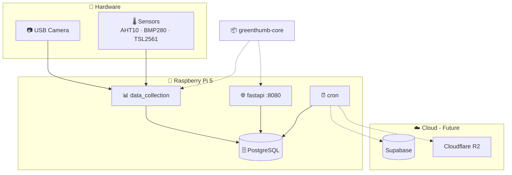
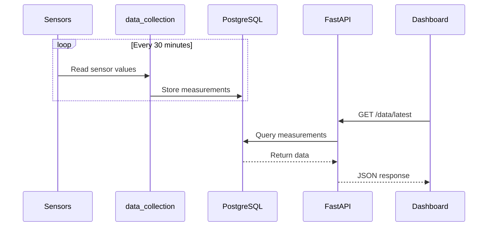
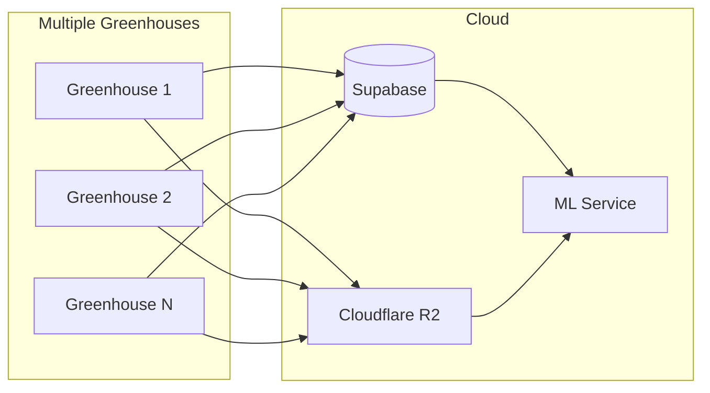

# Architecture Overview

GreenThumb uses a multi-repository, microservices architecture deployed on a Raspberry Pi 5.

## System Diagram

## Remote Access

### Current Setup: Tailscale VPN

The Raspberry Pi runs [Tailscale](https://tailscale.com) to provide:

- **Always-on IP address** - Access the Pi from anywhere without port forwarding
- **Secure development** - SSH and dashboard access from any location
- **CI/CD integration** - Deploy updates remotely via GitHub Actions

See [Tailscale Setup](../getting-started/tailscale-setup.md) for configuration details.

### Future Vision

For end users, we plan to enable remote greenhouse access without requiring VPN knowledge:

- Client accesses their greenhouse via web dashboard
- System handles secure connectivity transparently
- No Tailscale or VPN configuration needed by the user

## Services

### Data Collection

The `data_collection` service runs continuously, collecting:

- **Sensor data** every 30 minutes
- **Photos** every 4 hours

Data is stored in the local PostgreSQL database.

### FastAPI

The `api` service provides:

- REST API endpoints for data access
- Live video streaming from the camera
- Static dashboard

### PostgreSQL

Local database storing:

- Device and sensor configurations
- Plant species catalog
- Measurement history
- Cultivation records

### Cron (Optional)

Scheduled tasks for:

- Cloud database sync (future)
- Local database cleanup
- Backup operations

## Data Flow

## Technology Decisions

| Decision | Choice | Rationale |
|----------|--------|-----------|
| Controller | Raspberry Pi 5 | Powerful, runs Linux, Python support |
| Database | PostgreSQL | Robust, good for time-series data |
| ORM | SQLModel | Combines Pydantic + SQLAlchemy |
| Containers | Docker | Easy deployment, reproducibility |
| CI/CD | GitHub Actions | Automatic builds on push |
| Remote Access | Tailscale | Secure, easy VPN for development |

## Future Architecture

