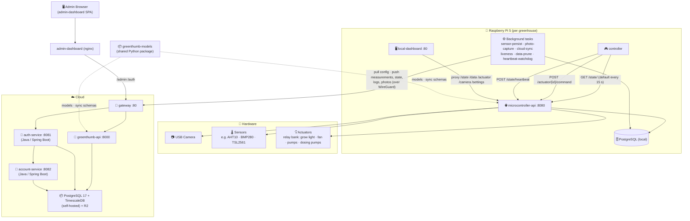
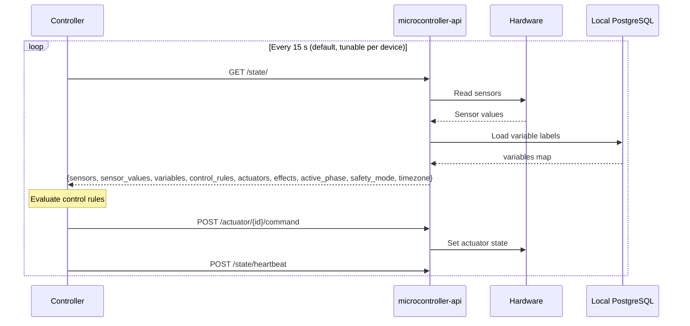
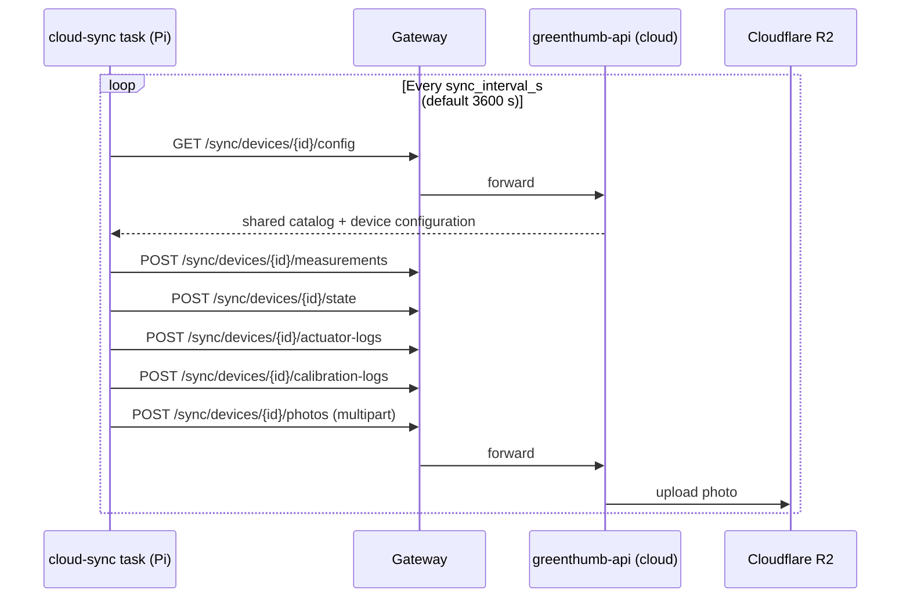

# Architecture Overview

GreenThumb is a **Cloud + Pi hybrid** system: one or more Raspberry Pi 5 nodes each run a fully self-contained greenhouse controller (local database, API, hardware drivers, local dashboard), while a shared cloud backend aggregates data, manages identity, and allows remote administration across the fleet.

## System Diagram

```mermaid
flowchart TB
    subgraph PI["🍓 Raspberry Pi 5 (per greenhouse)"]
        direction TB
        CTRL["🎮 controller"]
        API["🌐 microcontroller-api :8080"]
        PIDB[("🗄️ PostgreSQL (local)")]
        BG["⚙️ Background tasks\nsensor-persist · photo-capture · cloud-sync\nliveness · data-prune · heartbeat-watchdog"]
        DASH["🖥️ local-dashboard :80"]
    end

    subgraph HW["🔌 Hardware"]
        CAM["📷 USB Camera"]
        SENSORS["🌡️ Sensors\ne.g. AHT10 · BMP280 · TSL2561"]
        ACTUATORS["💡 Actuators\nrelay bank: grow light · fan · pumps · dosing pumps"]
    end

    subgraph CLOUD["☁️ Cloud"]
        direction TB
        GW["🔀 gateway :80"]
        FASTAPI["🐍 greenthumb-api :8000"]
        AUTH["🔐 auth-service :8081\n(Java / Spring Boot)"]
        ACCT["👤 account-service :8082\n(Java / Spring Boot)"]
        SUPA["📦 PostgreSQL 17 + TimescaleDB\n(self-hosted) + R2"]
    end

    BROWSER["🖥️ Admin Browser\n(admin-dashboard SPA)"]
    MODELS["📦 greenthumb-models\n(shared Python package)"]

    %% Controller ↔ API
    CTRL -->|"GET /state/ (default every 15 s)"| API
    CTRL -->|"POST /actuator/{id}/command"| API
    CTRL -->|"POST /state/heartbeat"| API

    %% API ↔ Hardware
    API --> CAM
    API --> SENSORS
    API --> ACTUATORS

    %% API ↔ local DB
    API --> PIDB
    BG --> PIDB

    %% Dashboard ↔ API
    DASH -->|"proxy /state /data /actuator /camera /settings"| API

    %% Pi ↔ Cloud
    BG -->|"pull config · push measurements, state,\nlogs, photos (over WireGuard)"| GW
    GW --> FASTAPI
    GW --> AUTH
    AUTH --> ACCT
    FASTAPI --> SUPA
    AUTH --> SUPA
    ACCT --> SUPA

    %% Admin browser ↔ Gateway
    BROWSER --> ADM["admin-dashboard (nginx)"]
    ADM -->|"/admin /auth"| GW

    %% Shared library
    MODELS -.->|"models · sync schemas"| API
    MODELS -.->|"models · sync schemas"| FASTAPI
```

The admin dashboard and cloud API are not publicly reachable yet; only the landing site is public.

## Two Tiers of Storage

| Location | Database | Purpose |
|----------|----------|---------|
| **Pi-local** | PostgreSQL (inside Docker) | Real-time readings, actuator state, cultivations and control rules, photo metadata |
| **Cloud** | Self-hosted PostgreSQL 17 + TimescaleDB | Fleet-wide history, aggregated measurements, user accounts, device registry |

Measurements, logs, photos and device-owned state (cultivations, phases, control rules) flow **Pi → Cloud** on every sync cycle. Configuration flows **Cloud → Pi** at the start of every cycle: the shared catalog is overwritten, device configuration converges by last-write-wins. When the cloud is unreachable the Pi keeps running from its local database.

## Package Architecture

The Python codebase is split into two installable packages:

| Package | Location | Contents |
|---------|----------|---------|
| `greenthumb` (repo `greenthumb-models`) | `rasp5/greenthumb-models/` | SQLModel table definitions, Pydantic DTOs, sync schemas — imported by **both** the Pi API and the cloud API |
| `greenthumb-rpi5` | `rasp5/greenthumb-rpi5/` | Hardware drivers (sensors, actuators, camera), DeviceManager — Pi only |

## Services

### Raspberry Pi (per device)

| Service | Port | Role |
|---------|------|------|
| `api` (microcontroller-api) | 8080 | Hardware control, REST API, MJPEG stream |
| `controller` | — | Sense-Think-Act loop (default every 15 s, tunable per device) |
| `local-dashboard` | 80 | React SPA served by nginx, proxied to api |
| `db` | 5432 (published on the Pi host) | Local PostgreSQL |
| `watchtower` | — | Checks for new images hourly; updates local-dashboard automatically; api/controller updates are promoted by hand |

Six asyncio background tasks run inside the API process; their intervals are per-device runtime settings (`GET/PATCH /settings/runtime`):

- **sensor-persist** (`sensor_interval_s`, 300 s)
- **photo-capture** (`photo_interval_s`, 4 h)
- **cloud-sync** (`sync_interval_s`, 3600 s): pulls config, then pushes measurements, device state, actuator and calibration logs, photos
- **liveness** (pings the cloud)
- **data-prune** (prunes old local data)
- **heartbeat-watchdog** (`heartbeat_timeout_s`, 60 s): puts actuators in a safe state when the controller stops sending heartbeats

### Cloud

| Service | Port | Role |
|---------|------|------|
| `gateway` | 80 | Spring Cloud Gateway: `/admin/**`, `/sync/**` and `/` → greenthumb-api; `/auth/**` → auth-service |
| `greenthumb-api` | 8000 | FastAPI — admin CRUD + Pi sync endpoints |
| `auth-service` | 8081 | Java Spring Boot — JWT login & validation |
| `account-service` | 8082 | Java Spring Boot: user accounts; internal only (called by auth-service, not routed by the gateway) |
| `dashboard` (admin-dashboard) | 80 | React SPA served by nginx; proxies `/admin/` and `/auth/` to the gateway |
| `landing` (landing-page) | 80 | Public landing site, React app served by nginx |

The **admin-dashboard** and **landing-page** React apps are served by their own nginx containers in the same Compose stack. Only the landing site is public today.

## Authentication Model

| Actor | Mechanism |
|-------|-----------|
| **Human users** (admin dashboard) | JWT issued by `auth-service` at login and sent as an HttpOnly `access_token` cookie (or `Authorization: Bearer`). greenthumb-api validates it on every request via `GET /auth/validate`, which returns the user id and current role (`user` or `admin`). |
| **Pi devices** (sync calls) | Per-device `device_token` (`secrets.token_urlsafe(32)`) sent as `Authorization: Bearer <token>`; validated against the `device` table |

## Data Flow: Sense-Think-Act Loop

```mermaid
sequenceDiagram
    participant CTRL as Controller
    participant API as microcontroller-api
    participant HW as Hardware
    participant DB as Local PostgreSQL

    loop Every 15 s (default, tunable per device)
        CTRL->>API: GET /state/
        API->>HW: Read sensors
        HW-->>API: Sensor values
        API->>DB: Load variable labels
        DB-->>API: variables map
        API-->>CTRL: {sensors, sensor_values, variables, control_rules, actuators, effects, active_phase, safety_mode, timezone}

        Note over CTRL: Evaluate control rules

        CTRL->>API: POST /actuator/{id}/command
        API->>HW: Set actuator state

        CTRL->>API: POST /state/heartbeat
    end
```

## Data Flow: Cloud Sync

```mermaid
sequenceDiagram
    participant BG as cloud-sync task (Pi)
    participant GW as Gateway
    participant API as greenthumb-api (cloud)
    participant R2 as Cloudflare R2

    loop Every sync_interval_s (default 3600 s)
        BG->>GW: GET /sync/devices/{id}/config
        GW->>API: forward
        API-->>BG: shared catalog + device configuration
        BG->>GW: POST /sync/devices/{id}/measurements
        BG->>GW: POST /sync/devices/{id}/state
        BG->>GW: POST /sync/devices/{id}/actuator-logs
        BG->>GW: POST /sync/devices/{id}/calibration-logs
        BG->>GW: POST /sync/devices/{id}/photos (multipart)
        GW->>API: forward
        API->>R2: upload photo
    end
```

The Pi never contacts R2 directly: it sends photos to the cloud API, which uploads them.

## Technology Decisions

| Decision | Choice | Rationale |
|----------|--------|-----------|
| Pi OS | Raspberry Pi OS Lite 64-bit | Headless, 64-bit for Docker, official Pi 5 kernel |
| Pi database | PostgreSQL 17 | Robust, matches cloud schema |
| ORM | SQLModel | Combines Pydantic + SQLAlchemy; one model for DB + API |
| Shared models | `greenthumb-models` package | Single source of truth for both Pi and cloud |
| Cloud API | FastAPI (Python) | Fast async, auto OpenAPI, shares SQLModel models |
| Cloud DB | Self-hosted PostgreSQL 17 + TimescaleDB | Full control of the data, hypertables for time-series, no vendor dependency |
| Auth | Java Spring Boot (JWT) | Isolated, battle-tested JWT library (jjwt) |
| Gateway | Spring Cloud Gateway | Declarative path routing; one entry point for the backend |
| Frontends | React + Vite + Tailwind v3 (dashboards also use TanStack Query v5) | Modern, type-safe, reactive |
| Photo storage | Cloudflare R2 | S3-compatible, no egress fees, private bucket |
| Remote access | Self-hosted WireGuard | Encrypted hub-and-spoke VPN, no public ports, no third-party coordination server |
| OTA (images) | Watchtower | Image updates (automatic for dashboards, manual promotion for control services) |

## GreenthumbOS (Planned)

A ready-to-flash Raspberry Pi OS image (GreenthumbOS) is planned.
