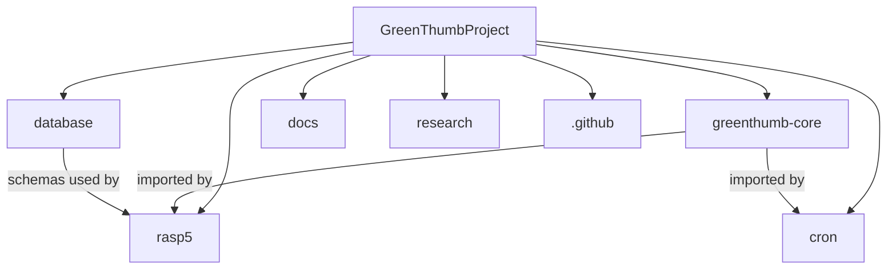

# Repositories

GreenThumb uses a multi-repository architecture for better separation of concerns and scalability.

## Repository Structure



## Core Repositories

### greenthumb-core

**Private** | Python Package

Shared library containing:

- SQLModel database definitions
- Database utilities (engine, session)
- Raspberry Pi 5 hardware interfaces
- Sensor drivers

```bash
# Install in other projects
pip install git+https://${GH_PAT}@github.com/GreenThumbProject/greenthumb-core.git
```

### rasp5

**Private** | Docker Compose Deployment

Main Raspberry Pi 5 deployment:

- Docker Compose configuration
- FastAPI service
- Data collection service
- Makefile commands

### database

**Private** | SQL Schemas

Database management:

- PostgreSQL schemas
- Seed data
- Future: Alembic migrations

### cron

**Private** | Scheduled Tasks

Cron jobs and scheduled tasks:

- Cloud sync (Supabase)
- Image upload (Cloudflare R2)
- Database cleanup

## Documentation & Research

### docs

**Public** | MkDocs Site

This documentation website:

- Installation guides
- Architecture docs
- API reference
- Project summaries (EN/PT)

Deployed to: [greenthumbproject.github.io/docs](https://greenthumbproject.github.io/docs)

### research

**Private** | Academic Materials

Research project documents:

- PIBITI proposal
- Research paper (PT/EN)
- References and notes

### .github

**Public** | Organization Profile

Organization-level files:

- Profile README
- AI context file
- Shared issue templates

## Future Repositories

| Repository | Purpose |
|------------|---------|
| `greenthumb-esp32` | ESP32 library (if modular) |
| `cloud` | Supabase/Cloudflare integration |
| `ml` | Machine learning models |

## Naming Convention

- **`greenthumb-*`** - Only for installable packages/libraries
- **Short names** - For applications and deployments

Examples:

- ✅ `greenthumb-core` (Python package)
- ✅ `rasp5` (deployment)
- ✅ `database` (not an installable package)
- ❌ `greenthumb-database` (not a package)
