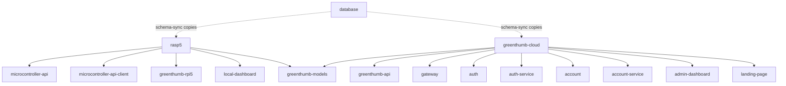

# Repositories

GreenThumb's code lives in the `GreenThumbProject` GitHub organization. Two superprojects pull the individual repositories in as git submodules: `rasp5` for the Raspberry Pi node and `greenthumb-cloud` for the cloud backend. All repositories are private except `docs` (this site) and `.github` (the organization profile).

## Repository Structure

```mermaid
graph TB
    RASP5[rasp5]
    CLOUD[greenthumb-cloud]
    MODELS[greenthumb-models]
    DB[database]

    RASP5 --> API[microcontroller-api]
    RASP5 --> CLIENT[microcontroller-api-client]
    RASP5 --> RPI5[greenthumb-rpi5]
    RASP5 --> LDASH[local-dashboard]
    RASP5 --> MODELS

    CLOUD --> GAPI[greenthumb-api]
    CLOUD --> GW[gateway]
    CLOUD --> AUTH[auth]
    CLOUD --> AUTHS[auth-service]
    CLOUD --> ACC[account]
    CLOUD --> ACCS[account-service]
    CLOUD --> ADM[admin-dashboard]
    CLOUD --> LAND[landing-page]
    CLOUD --> MODELS

    DB -.->|"schema-sync copies"| RASP5
    DB -.->|"schema-sync copies"| CLOUD
```

Solid arrows are submodules. `greenthumb-models` is a submodule of both superprojects. The `database` repository is not a submodule: its schema is copied into each superproject.

## Edge (Raspberry Pi node)

| Repository | Role |
|------------|------|
| `rasp5` | Superproject for the Pi node: Docker Compose stack and its 5 submodules |
| `microcontroller-api` | FastAPI service on the Pi (:8080): hardware control, local data, settings |
| `microcontroller-api-client` | The controller: Sense-Think-Act loop over the Pi API |
| `greenthumb-rpi5` | Hardware drivers and the DeviceManager |
| `local-dashboard` | React dashboard served on the node |

## Cloud

| Repository | Role |
|------------|------|
| `greenthumb-cloud` | Superproject for the cloud backend: Docker Compose stack and its 9 submodules |
| `greenthumb-api` | FastAPI service: admin API and Pi sync endpoints |
| `gateway` | Spring Cloud Gateway, the backend's single entry point |
| `auth` + `auth-service` | JWT login and validation (library + Spring Boot service) |
| `account` + `account-service` | User accounts (library + Spring Boot service) |
| `admin-dashboard` | React admin dashboard |
| `landing-page` | React landing site |

## Shared

| Repository | Role |
|------------|------|
| `greenthumb-models` | Python package `greenthumb`: SQLModel tables, sync schemas, shared helpers; used by the Pi API and the cloud API |
| `database` | SQL source of truth: schemas, seeds and dated SQL migrations |

## Other

| Repository | Role |
|------------|------|
| `peripheral-drivers-dev` | Notebooks for testing peripheral drivers on real hardware |
| `research` | Research materials (private) |
| `docs` | This documentation site (public) |
| `.github` | Organization profile (public) |

## Archived

`greenthumb-core` (the former shared library, no longer used) and `legacy`.
