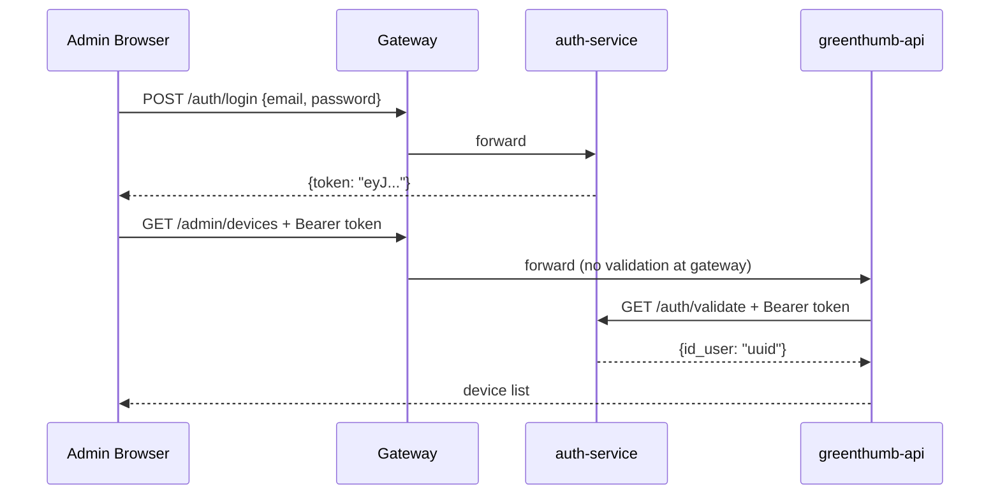
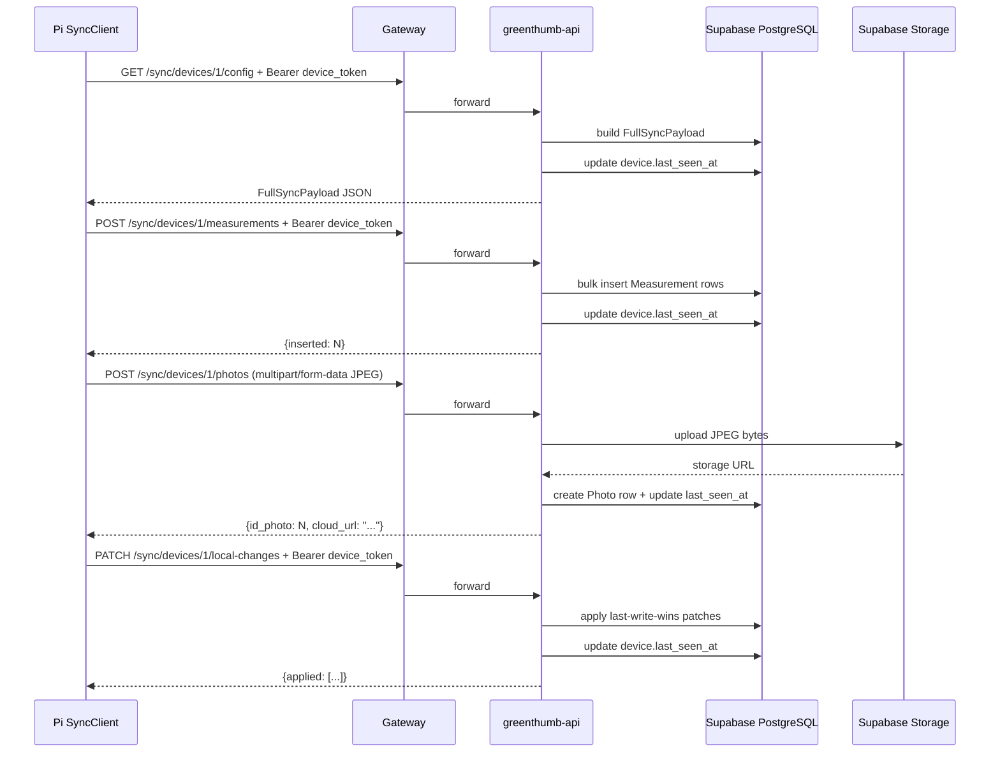

# Cloud Backend

The `cloud/` directory contains all server-side services that aggregate data from multiple Pi nodes, manage user accounts, and serve the admin dashboard.

## Repository Structure

```
cloud/
├── greenthumb-api/          # FastAPI — admin CRUD + Pi sync routes
│   ├── main.py              # FastAPI app with lifespan
│   ├── db.py                # SQLAlchemy engine (pool_pre_ping + pool_recycle=240)
│   ├── config_builder.py    # Builds FullSyncPayload from cloud DB
│   ├── auth/
│   │   ├── user_auth.py     # JWT validation via auth-service
│   │   └── device_auth.py   # Device token validation
│   ├── routes/
│   │   ├── admin/
│   │   │   ├── router.py    # /admin/** — JWT-protected CRUD
│   │   │   └── devices.py   # Custom device router (token gen, id_user auto-assign)
│   │   └── sync/
│   │       └── sync_routes.py  # /sync/** — device-token-protected sync
│   └── Dockerfile
├── auth-service/            # Java Spring Boot — JWT issuance + validation
├── account-service/         # Java Spring Boot — user account management
├── gateway/                 # Spring Cloud Gateway — routing + path rewriting
├── admin-dashboard/         # React + Vite + Tailwind SPA (deployed separately)
│   ├── src/
│   │   ├── context/AuthContext.jsx   # JWT in localStorage
│   │   ├── api/cloudApi.js           # TanStack Query hooks
│   │   └── pages/                    # Devices, Hardware, Species, Cultivations, etc.
│   └── nginx.conf
└── compose.yaml             # Local development Docker Compose
```

## Services

The local development Docker Compose (`cloud/compose.yaml`) defines four services. The admin dashboard is run separately (e.g., `cd admin-dashboard && npm run dev`).

### Gateway (port 80)

Spring Cloud Gateway is the single entry point for all cloud traffic. Routes by path prefix:

| Prefix | Backend | Auth |
|--------|---------|------|
| `/auth/**` | auth-service :8081 | Public |
| `/accounts/**` | account-service :8082 | JWT |
| `/admin/**` | greenthumb-api :8000 | JWT |
| `/sync/**` | greenthumb-api :8000 | Device token |

### greenthumb-api (port 8000)

FastAPI application with two router groups:

- **`/admin`** — CRUD for all entities, JWT-protected (`Depends(get_current_user_id)`)
- **`/sync`** — Pi ↔ Cloud sync endpoints, device-token-protected (`Depends(get_authenticated_device)`)

Uses `pool_pre_ping=True` and `pool_recycle=240` on the SQLAlchemy engine to prevent stale-connection errors from Supabase's 5-minute idle timeout.

Shares `greenthumb-models` with the Pi API — the same SQLModel definitions drive both databases.

### auth-service (port 8081)

Java Spring Boot microservice:

- `POST /auth/login` — BCrypt password check, returns JWT (jjwt)
- `GET /auth/validate` — Verifies JWT signature, returns `{"id_user": "<uuid>"}`

### account-service (port 8082)

Java Spring Boot microservice for user account CRUD. Backed by Supabase PostgreSQL.

### admin-dashboard

React SPA (built with Vite + Tailwind + TanStack Query) served independently — not in `compose.yaml`. Communicates with the gateway at port 80.

| Page | Route | Description |
|------|-------|-------------|
| Login | `/login` | Email/password form → JWT stored in localStorage |
| Devices | `/devices` | Register devices, view online status badge (`last_seen_at`), edit config, attach sensors/actuators, rotate tokens, open local dashboard via Tailscale IP |
| Species | `/species` | Plant species + growth phase editor |
| Cultivations | `/cultivations` | Cultivation list + inline threshold CRUD |
| Hardware | `/hardware` | Sensor model + actuator model catalog with create forms; read-only variables and units tables |
| Data | `/data` | Line charts + raw measurement table |
| Photos | `/photos` | Photo gallery grid with device/cultivation filters |

## Authentication Flow



## Device Sync Flow



## Local Development

```bash
cd cloud
cp .env.example .env
# Set DATABASE_URL, DB_URL, JWT_SECRET, SUPABASE_URL, SUPABASE_KEY
docker compose up --build
```

Services available at:
- greenthumb-api docs: `http://localhost:8000/docs`
- Gateway: `http://localhost:80`
- Set `DEV_AUTH_BYPASS=true` to skip JWT validation during development

Admin dashboard (run separately):
```bash
cd cloud/admin-dashboard
npm install
npm run dev   # http://localhost:5173
```
