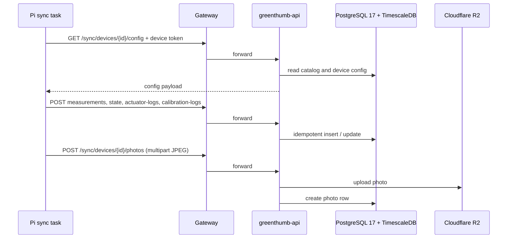

# Cloud Backend

The cloud backend collects data from every Pi node, manages users and the device fleet, and serves the admin dashboard and the public website. It lives in the `greenthumb-cloud` repository, a superproject whose services are git submodules.

## Repository Structure

```
cloud/
├── greenthumb-api/        # FastAPI — admin CRUD + Pi sync routes (:8000)
├── auth-service/, auth/   # Spring Boot JWT service (:8081) + its library
├── account-service/, account/ # Spring Boot user accounts (:8082) + its library
├── gateway/               # Spring Cloud Gateway — single ingress (:80)
├── admin-dashboard/       # React + Vite + Tailwind SPA
├── landing-page/          # Public marketing site (React)
├── greenthumb-models/     # shared `greenthumb` package (submodule)
├── db/                    # GENERATED by `make schema-sync` from database/ — do not edit
├── deploy/                # production stack for the cloud VM
├── k8s/                   # unmaintained sketch — not used (see Kubernetes)
└── compose.yaml           # Local development Docker Compose
```

## Services

The local stack in `cloud/compose.yaml` runs every service:

| Service | Local port | Role |
|---------|------------|------|
| `gateway` | 80 | Spring Cloud Gateway, the single entry point for the backend |
| `greenthumb-api` | 8000 | FastAPI: admin CRUD and Pi sync routes |
| `auth-service` | 8081 | Spring Boot: login, logout, registration, JWT validation |
| `account-service` | 8082 | Spring Boot: user accounts. Internal only, called by auth-service |
| `dashboard` | 443 (plain HTTP) | The admin dashboard (nginx) |
| `landing` | 8083 | The public website (nginx) |
| `db` | 5432 | PostgreSQL 17 + TimescaleDB |

### Gateway routing

| Path prefix | Backend | Auth |
|-------------|---------|------|
| `/auth/**` | auth-service | Public |
| `/admin/**` | greenthumb-api | JWT (`access_token` cookie, or Bearer) |
| `/sync/**` | greenthumb-api | Device bearer token |
| `/` | greenthumb-api | Public (liveness) |

account-service is not routed by the gateway.

### greenthumb-api

FastAPI with two router groups: `/admin` for the admin dashboard and `/sync` for the Pi nodes. It imports the shared `greenthumb` package (repo `GreenThumbProject/greenthumb-models`), the same package the Pi uses, from this repo's own submodule at `greenthumb-models/` (`.gitmodules` branch `prod`). The Dockerfile copies it from the repo-root build context:

```dockerfile
COPY greenthumb-models/ /tmp/greenthumb-models/
RUN pip install --no-cache-dir "/tmp/greenthumb-models[api]"
```

Fresh clones: `git submodule update --init --recursive`. The pin is not bumped by hand: when greenthumb-models changes, rasp5 CI's `bump-cloud-pin` job pushes the same SHA into this repo's `prod` branch, and that push triggers `cloud-images.yml`. Both tiers therefore share table definitions, sync schemas and sync logic (`greenthumb.sync`).

### admin-dashboard

A React + Vite + Tailwind SPA served by its own nginx container, which proxies `/admin/` and `/auth/` to the gateway. Sign-in is cookie-only: the dashboard reads the signed-in identity from `GET /admin/me`.

| Page | Route | Description |
|------|-------|-------------|
| Login | `/login` | Email/password sign-in |
| Fleet | `/` | Devices grouped by property, online/stale/offline status |
| Device | `/devices/:id[/:tab]` | One device: components, rules, token rotation |
| Cultivations | `/cultivations` | Fleet-wide current cultivations |
| Activity | `/activity` | Actuator and rule activity |
| Species | `/catalog/species` | Plant species, phases, control rules |
| Hardware | `/catalog/hardware` | Boards, sensors, actuators, connectors |
| Units & variables | `/catalog/units` | Measurement units and variables |
| Data Explorer | `/data` | Charts, CSV export, photos |
| Settings | `/settings` | Signed-in identity, sign-out |
| Users | `/admin/users` | User accounts and roles (admin only) |
| Properties | `/admin/properties` | Properties (admin only) |

Each Fleet card links to the node's local dashboard (reachable only from inside the project VPN).

### landing-page

The public marketing site, a React + Vite + Tailwind app served by its own nginx container (`landing`). It is the only part of the cloud stack that is publicly reachable.

## Authentication

**Users** log in with `POST /auth/login`; auth-service sets an HttpOnly `access_token` cookie, which greenthumb-api reads first (an `Authorization: Bearer <jwt>` header is still accepted).

greenthumb-api validates the JWT on every request by calling `GET /auth/validate`, which returns `{id_user, role}`. `POST /auth/logout` signs out, and `POST /auth/register` is admin-only.

**Pi devices** authenticate with a per-device token (`device.device_token`), rotated on the device page (Fleet → device → Rotate token) and sent as `Authorization: Bearer <device_token>` on `/sync/**`.

## Device Sync

Every sync cycle the Pi pulls its configuration, then pushes its data. All routes are under `/sync/devices/{id}/`:

| Method | Path | Purpose |
|--------|------|---------|
| GET | `config` | Catalog and device configuration for the Pi |
| POST | `ping` | Liveness |
| POST | `measurements` | Sensor readings |
| POST | `state` | Device-owned state (cultivations, phases, control rules) |
| POST | `actuator-logs` | Actuator command log |
| POST | `calibration-logs` | Probe and pump calibration log |
| POST | `photos` | One photo (multipart) |
| POST | `photos/batch` | Several photos (returns 207) |


```mermaid
sequenceDiagram
    participant Pi as Pi sync task
    participant GW as Gateway
    participant API as greenthumb-api
    participant DB as PostgreSQL 17 + TimescaleDB
    participant R2 as Cloudflare R2

    Pi->>GW: GET /sync/devices/{id}/config + device token
    GW->>API: forward
    API->>DB: read catalog and device config
    API-->>Pi: config payload

    Pi->>GW: POST measurements, state, actuator-logs, calibration-logs
    GW->>API: forward
    API->>DB: idempotent insert / update

    Pi->>GW: POST /sync/devices/{id}/photos (multipart JPEG)
    GW->>API: forward
    API->>R2: upload photo
    API->>DB: create photo row
```

The Pi never talks to R2 directly: it sends photos to the API, which uploads them.

## Storage

- **Database:** self-hosted PostgreSQL 17 with TimescaleDB. See [Database](database.md).
- **Photos:** Cloudflare R2, written by greenthumb-api.

## Environment Variables

### `cloud/.env` (local) · `deploy/.env` (VM)

Compose builds both connection strings from the same `DB_*` parts (SQLAlchemy `DATABASE_URL` for greenthumb-api, JDBC `DB_URL` for the Java services), so they cannot drift.

| Variable | Consumed by | Description |
|----------|-------------|-------------|
| `DB_HOST` `DB_PORT` `DB_NAME` `DB_USER` `DB_PASSWORD` | all (via compose) | Postgres connection parts; `DB_HOST=db` is the compose TimescaleDB service |
| `JWT_SECRET` | `auth-service` | JWT signing secret (greenthumb-api validates by calling auth-service) |
| `INTERNAL_SERVICE_TOKEN` | `auth-service`, `account-service` | Shared secret for auth→account calls; must match |
| `DEV_AUTH_BYPASS` | `greenthumb-api` | Skip JWT validation (local only; hardcoded `false` on the VM) |
| `R2_ACCOUNT_ID` `R2_ACCESS_KEY_ID` `R2_SECRET_ACCESS_KEY` `R2_BUCKET` `R2_JURISDICTION` | `greenthumb-api` | Cloudflare R2 for Pi photo uploads; unset = no `cloud_url` |
| `CORS_ORIGINS` | `greenthumb-api` | Allowed credentialed origins (VM) |
| `SYNC_CONTRACT_ENFORCE` `ALERT_WEBHOOK_URL` `DEVICE_OFFLINE_CHECK_S` | `greenthumb-api` | Optional fleet-safety knobs |
| `IMAGE_TAG` `DOCKERHUB_USERNAME` | `deploy/` compose | Image selection / rollback pin |

## Production

Production runs on one VM from `deploy/docker-compose.yml`, using pre-built images. The stack is `db`, `gateway`, `greenthumb-api`, `auth-service`, `account-service`, `dashboard`, `landing`, `watchtower` and an `nginx` reverse proxy. Only nginx is published to the internet.

!!! note
    The API and admin dashboard are not publicly reachable yet; only the public website is served publicly. Pi nodes reach the gateway over the project VPN.

A push to `prod` makes GitHub Actions (`cloud-images.yml`) build six images: gateway, greenthumb-api, auth-service, account-service, admin-dashboard and landing. On the VM, Watchtower updates the dashboard and the website automatically. The gateway, greenthumb-api, auth-service and account-service are updated by hand.

On the VM (Linux), from `deploy/`:

```bash
make ps        # service status
make promote   # pull and apply new images for the four gated services, health-gated
make logs-greenthumb-api
```

## Local Development

```powershell
cd cloud
git submodule update --init --recursive
cp .env.example .env
# Defaults target the local `db` container. Set JWT_SECRET; R2_* may stay
# unset (photos are then stored without a cloud_url).
# Optional: DEV_AUTH_BYPASS=true skips JWT checks (development only).
docker compose up --build
```

| URL | Service |
|-----|---------|
| `http://localhost:443` (plain HTTP) | Admin dashboard |
| `http://localhost:8083` | Landing page |
| `http://localhost:8000/docs` | API Swagger docs |
| `http://localhost:80` | Gateway |

To work on the admin dashboard with hot reload, run the Vite dev server. It proxies API calls to the gateway on port 80.

```powershell
cd cloud/admin-dashboard
npm install
npm run dev   # http://localhost:5173
```

## Kubernetes

`k8s/` is an unmaintained sketch and is not used. Production runs from `deploy/`.
