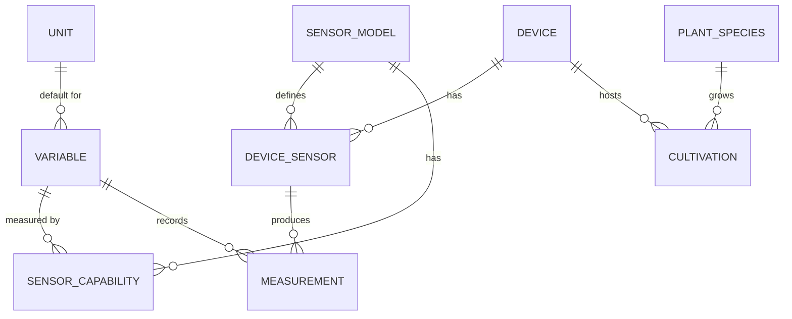

# Database

The `database` repository contains PostgreSQL schemas and seed data.

## Overview

This repository manages database structure separately from deployment code, enabling:

- Version-controlled schema changes
- Easy schema review and collaboration
- Future migration support with Alembic

## Repository Structure

```
database/
├── README.md
├── schemas/
│   ├── 01_schema.sql       # Table definitions
│   └── 02_seed.sql         # Initial data
├── migrations/             # Future: Alembic migrations
└── scripts/
    └── generate_ddl.py     # Schema generation from SQLModel
```

## Schema Overview

### Tables



### Core Tables

| Table | Purpose |
|-------|---------|
| `unit` | Measurement units (°C, %, hPa, lux) |
| `variable` | What is measured (Temperature, Humidity) |
| `device` | Greenhouse controllers (Raspberry Pi) |
| `sensor_model` | Sensor hardware (AHT10, BMP280) |
| `device_sensor` | Sensors attached to devices |
| `sensor_capability` | What each sensor can measure |
| `measurement` | Collected data points |
| `plant_species` | Plant catalog |
| `cultivation` | Plant growth records |

## Schema File

```sql
-- Unit table
CREATE TABLE IF NOT EXISTS unit (
    id_unit SERIAL PRIMARY KEY,
    symbol VARCHAR NOT NULL,
    name VARCHAR NOT NULL
);

-- Device table
CREATE TABLE IF NOT EXISTS device (
    id_device SERIAL PRIMARY KEY,
    name VARCHAR NOT NULL,
    mac_address VARCHAR,
    location VARCHAR,
    created_at TIMESTAMP DEFAULT CURRENT_TIMESTAMP
);

-- More tables...
```

See [01_schema.sql](https://github.com/GreenThumbProject/database/blob/main/schemas/01_schema.sql) for complete schema.

## Seed Data

The seed file provides initial data:

- Standard units (°C, %, hPa, lux)
- Common variables (Temperature, Humidity, Pressure, Light)
- Supported sensor models (AHT10, BMP280, TSL2561)
- Sensor capabilities

```sql
-- Units
INSERT INTO unit (symbol, name) VALUES
    ('°C', 'Celsius'),
    ('%', 'Percent'),
    ('hPa', 'Hectopascal'),
    ('lux', 'Lux');

-- Variables
INSERT INTO variable (name, description, default_unit_id) VALUES
    ('Temperature', 'Air temperature', 1),
    ('Humidity', 'Relative humidity', 2);
```

## Usage in rasp5

The schemas are mounted into PostgreSQL on startup:

```yaml
# compose.yaml
db:
  image: postgres:17.6
  volumes:
    - ./db/01_schema.sql:/docker-entrypoint-initdb.d/01_schema.sql:ro
    - ./db/02_seed.sql:/docker-entrypoint-initdb.d/02_seed.sql:ro
```

## Future: Migrations

We plan to add Alembic for schema migrations:

```bash
# Generate migration
alembic revision --autogenerate -m "Add new table"

# Apply migrations
alembic upgrade head
```
