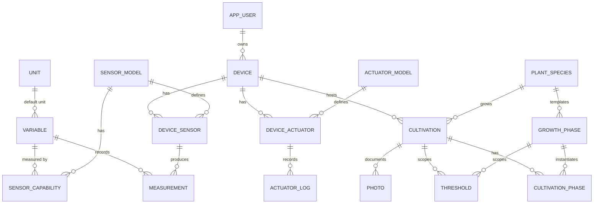

# Database

GreenThumb uses **two separate PostgreSQL 17 instances**: one local to each Raspberry Pi node, and one shared cloud instance (Supabase). Both share the same table definitions (from `greenthumb-models`) but serve different purposes.

## Two-Tier Database Architecture

| Instance | Location | Port | Purpose |
|----------|----------|------|---------|
| **Pi-local** | `rasp5/` Docker Compose | 5432 (internal) | Real-time sensor readings, actuator state, photo metadata, local config |
| **Cloud** | Supabase PostgreSQL | hosted | Fleet history, aggregated measurements, user accounts, device registry |

The Pi does **not** depend on the cloud to operate. All sensor reading, threshold evaluation, and actuator control happens entirely against the local database. The cloud sync is best-effort — the Pi queues unsynced rows and pushes them whenever connectivity is available.

## Schema Overview

All tables are defined as `SQLModel` classes in `rasp5/greenthumb-models/src/greenthumb_models/models.py` and automatically created by SQLAlchemy's `create_all()` on startup.



## Tables Reference

### Tier 0: Identity

| Table | Key columns | Description |
|-------|-------------|-------------|
| `app_user` | `id_user` (UUID), `name`, `email`, `created_at` | User accounts (source of truth in cloud) |

### Tier 1: Global Catalog

| Table | Key columns | Description |
|-------|-------------|-------------|
| `unit` | `id_unit`, `symbol`, `name` | Measurement units: °C, %, hPa, lux |
| `variable` | `id_variable`, `name`, `description`, `default_unit_id` | What is measured: Temperature, Humidity, Pressure, Light |
| `plant_species` | `id_plant_species`, `name`, `scientific_name` | Plant catalog |
| `growth_phase` | `id_growth_phase`, `id_plant_species`, `name`, `phase_order`, `is_default` | Reusable phase templates; `is_default=True` = "All Phases" sentinel |
| `sensor_model` | `id_sensor_model`, `model_name`, `manufacturer` | Sensor hardware catalog: AHT10, BMP280, TSL2561 |
| `actuator_model` | `id_actuator_model`, `model_name`, `actuator_type`, `manufacturer`, `model_config_json` | Actuator hardware catalog: RGBLED, WaterPump, Camera |
| `sensor_capability` | `id_sensor_model`, `id_variable`, `precision`, `accuracy`, `min_range`, `max_range` | Which variables each sensor model can measure |

### Tier 2: Device Configuration

| Table | Key columns | Description |
|-------|-------------|-------------|
| `device` | `id_device`, `name`, `mac_address`, `location`, `device_mode`, `id_user`, `device_token`, `created_at`, `updated_at` | Greenhouse Pi node; `device_token` is the Pi auth secret (cloud only: `last_seen_at`, `tailscale_ip`) |
| `device_sensor` | `id_device_sensor`, `id_device`, `id_sensor_model`, `port_address`, `is_active`, `installed_at` | Sensor instances attached to a device (port_address = I2C address) |
| `device_actuator` | `id_device_actuator`, `id_device`, `id_actuator_model`, `name`, `instance_config`, `is_active`, `installed_at` | Actuator instances; `instance_config` JSON holds GPIO pins, camera src, etc. |
| `cultivation` | `id_cultivation`, `id_device`, `id_plant_species`, `start_date`, `end_date`, `notes`, `updated_at` | One grow run; `end_date=NULL` = currently active |
| `threshold` | `id_threshold`, `id_cultivation`, `id_variable`, `id_growth_phase`, `min_value`, `max_value`, `target_value`, `id_actuator_action`, `is_active`, `updated_at` | Sensor target range; `id_actuator_action=NULL` = monitoring-only (Pi only: `is_dirty`) |

### Tier 3: Operational Data

| Table | Key columns | Description |
|-------|-------------|-------------|
| `measurement` | `id_measurement`, `id_device_sensor`, `id_variable`, `value`, `collected_at` | Individual sensor reading (Pi only: `is_synced`) |
| `cultivation_phase` | `id_cultivation_phase`, `id_cultivation`, `id_growth_phase`, `started_at`, `ended_at`, `detected_by`, `notes` | Active growth phase; `ended_at=NULL` = current phase |
| `photo` | `id_photo`, `id_device`, `id_device_actuator`, `id_cultivation`, `captured_at`, `file_path`, `cloud_url`, `file_size_bytes` | Photo metadata; `cloud_url` set after Supabase upload (Pi only: `is_synced`) |
| `actuator_log` | `id_log`, `id_device_actuator`, `action_at`, `action`, `payload`, `triggered_by` | Append-only actuator command audit trail |

### Pi-Only: Sync State

| Table | Key columns | Description |
|-------|-------------|-------------|
| `sync_metadata` | `key` (PK), `value`, `updated_at` | Key-value store for sync timestamps |

## Initialization

Schema is created automatically at startup via SQLAlchemy's `create_all()` (called in the FastAPI lifespan). Initial seed data (units, variables, sensor models, actuator models) is inserted by `db/02_seed.sql`, mounted into the PostgreSQL container:

```yaml
# rasp5/compose.yaml
db:
  image: postgres:17.6
  volumes:
    - ./db/01_schema.sql:/docker-entrypoint-initdb.d/01_schema.sql:ro
    - ./db/02_seed.sql:/docker-entrypoint-initdb.d/02_seed.sql:ro
```

The `create_all()` call is idempotent — safe to run on re-deploy.

## Cloud Schema Migration

When new columns are added to the cloud database (Supabase), migrations are kept in `database/schemas/cloud/`. Run them once in the Supabase SQL Editor:

```sql
-- Example: database/schemas/cloud/03_phase6_migration.sql
ALTER TABLE device ADD COLUMN IF NOT EXISTS last_seen_at TIMESTAMP;
ALTER TABLE device ADD COLUMN IF NOT EXISTS tailscale_ip VARCHAR;
```

## Accessing the Database

```bash
# Pi-local (via Makefile)
make db-shell       # opens psql inside the db container
```

## Sync State Tracking

Two columns drive the sync state machine:

- `measurement.is_synced` — set to `False` on insert (Pi), `True` after a successful `POST /sync/devices/{id}/measurements`
- `photo.is_synced` — set to `False` when captured locally, `True` after Supabase upload + cloud metadata push

The `sync_metadata` table stores wall-clock timestamps for observability:

| Key | Set when |
|-----|----------|
| `last_sensor_persist` | Sensor data written to local DB |
| `last_config_sync` | Config successfully pulled from cloud |
| `last_data_push` | Measurements + photos successfully pushed to cloud |

The cloud-side `device.last_seen_at` column is updated on every successful sync call (config pull, measurements push, or photo push) via the `_touch_last_seen()` helper in the sync routes. This timestamp drives the online/stale/offline status badge in the admin dashboard.

## Cloud-side Device Token

`device.device_token` is a `secrets.token_urlsafe(32)` string. It is:

- **Auto-generated** by `POST /admin/devices` at device creation time
- **Shown once** in the `DeviceAdminRead` response at creation — copy it immediately
- **Rotatable** via `POST /admin/devices/{id}/token` (requires user JWT)
- **Never returned** in subsequent read responses
- **Used by the Pi** as `Authorization: Bearer <token>` on every sync call
- **Stored in** `rasp5/.env` as `DEVICE_TOKEN`
