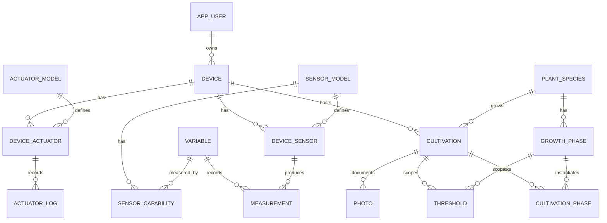

# Python Packages

GreenThumb's Python codebase is split into two focused packages and one thin compatibility shim, all located inside the `rasp5/` monorepo directory.

## Package Map

```
rasp5/
├── greenthumb-models/   ← shared models (Pi + Cloud)
├── greenthumb-rpi5/     ← Pi hardware drivers
└── greenthumb-core/     ← compatibility re-export shim
```

---

## greenthumb-models

**Location:** `rasp5/greenthumb-models/`  
**Imported by:** `microcontroller-api` (Pi) **and** `greenthumb-api` (Cloud)

Contains the single source of truth for all database table definitions and data-transfer schemas used across both tiers.

### Package Structure

```
greenthumb_models/
├── models.py        # SQLModel table definitions (all entities)
└── sync_schemas.py  # Pydantic DTOs for Pi ↔ Cloud sync
```

### Database Models (`models.py`)

All tables are declared as `SQLModel` classes (acts as both ORM model and Pydantic schema).  
Cloud-only fields (`last_seen_at`, `tailscale_ip` on `Device`) are conditionally added when `IS_CLOUD=1`.  
Pi-only fields (`is_dirty`, `is_synced`) are conditionally added when `IS_CLOUD` is unset.

```python
from greenthumb_models.models import (
    # Identity
    AppUser, AppUserRead,
    Device, DeviceCreate, DeviceRead, DeviceUpdate,
    DeviceAdminRead,       # includes device_token, last_seen_at, tailscale_ip
    DeviceAdminUpdate,

    # Hardware catalog
    SensorModel, ActuatorModel,
    DeviceSensor, DeviceActuator,
    Variable, Unit,
    SensorCapability,

    # Cultivation tree
    PlantSpecies,
    GrowthPhase,
    Cultivation, CultivationPhase,
    Threshold,

    # Operational
    Measurement,
    Photo,
    ActuatorLog,
    SyncMetadata,
)
```

#### Key relationships



#### Conditional fields by tier

| Field | Table | Present on |
|-------|-------|------------|
| `is_dirty` | `device`, `threshold` | Pi only (`IS_CLOUD` unset) |
| `is_synced` | `measurement`, `photo` | Pi only |
| `last_seen_at` | `device` | Cloud only (`IS_CLOUD=1`) |
| `tailscale_ip` | `device` | Cloud only |

### Sync Schemas (`sync_schemas.py`)

Pure Pydantic DTOs (not SQLModel tables) used by `config_builder.py`, `SyncClient`, and `/sync/` routes:

```python
from greenthumb_models.sync_schemas import (
    DeviceConfig,       # top-level DTO passed to DeviceManager.init_from_config()
    ActivePhaseInfo,    # currently active cultivation phase (ended_at IS NULL)
    ThresholdConfig,    # one threshold with is_default_phase flag
    SensorConfig,       # one device sensor with capabilities list
    ActuatorConfig,     # one device actuator with instance + model config
    CapabilityConfig,   # one variable a sensor can measure
)
```

`DeviceConfig` is the authoritative configuration object — built by `config_builder.py` on both the Pi (from local DB) and the cloud (from cloud DB), and validated with `DeviceConfig.model_validate(raw)` on the receiving end.

---

## greenthumb-rpi5

**Location:** `rasp5/greenthumb-rpi5/`  
**Imported by:** `microcontroller-api` (Pi only — hardware-specific)

Contains all Raspberry Pi 5 hardware interfaces and the DeviceManager.

### Package Structure

```
greenthumb_rpi5/
├── device.py     # DeviceManager — top-level device orchestration
├── sensor.py     # Sensor base class + AHT10, BMP280, TSL2561 drivers
├── actuator.py   # Actuator base class + RGBLED, WaterPump, Camera drivers
├── schemas/      # Pi-specific Pydantic schemas (SystemState, ActuatorCommand, etc.)
└── __init__.py
```

### DeviceManager

The central object that holds runtime state for one greenhouse device:

```python
from greenthumb_rpi5.device import DeviceManager

dm = DeviceManager(id=device_id)

# Option A — initialize from a DeviceConfig (preferred, used in lifespan)
from greenthumb_models.sync_schemas import DeviceConfig
dm.init_from_config(config: DeviceConfig)

# Option B — initialize from local DB (fallback)
with Session(engine) as session:
    dm.init(session)

# Runtime usage
data      = dm.read_data()                     # dict[id_sensor, dict[var_name, value]]
values    = dm.get_sensor_values_by_variable() # dict[id_variable, float] — flat map
saved     = dm.save_data(session)              # persist current readings → Measurement rows
await dm.command_actuator(id, command)         # thread-safe actuator command
dm.heartbeat()                                 # reset safety-mode timer
dm.reload_cultivation(session)                 # reload thresholds + active phase after begin/end

# Read-only state
thresholds = dm.get_thresholds()               # list[dict] — active thresholds
phase      = dm.get_active_phase()             # ActivePhaseInfo | None
safety     = dm.get_safety_mode()             # bool

# Key attributes
dm.id                     # int — device ID
dm.id_active_cultivation  # int | None — current cultivation
dm.actuators              # dict[int, Actuator]
dm.sensors                # dict[int, Sensor]
```

#### `reload_cultivation(session)`

Re-queries the local DB for the active `Cultivation`, its `Threshold` rows, and the open `CultivationPhase`. Updates `dm.thresholds`, `dm.id_active_cultivation`, and `dm.active_phase` in-place. Called by `POST /settings/cultivation/begin` and `POST /settings/cultivation/end` so the controller picks up the change on its next cycle without a restart.

### Camera

```python
from greenthumb_rpi5.actuator import Camera

camera = Camera(src='/dev/video0', width=1280, height=720)

# Capture a JPEG and write to disk
path = camera.capture_photo(
    photos_dir='/data/photos',
    device_id=1,
    cultivation_id=3,   # optional
)
# Returns: absolute path str, or None if no frame available

# MJPEG frame for streaming
frame_bytes = camera.get_latest_frame()
```

### Sensors

```python
from greenthumb_rpi5.sensor import AHT10, BMP280, TSL2561

aht = AHT10()
data = aht.update_state()   # dict[variable_name, value]

bmp = BMP280()
data = bmp.update_state()

tsl = TSL2561()
data = tsl.update_state()
```

### Actuators

```python
from greenthumb_rpi5.actuator import RGBLED, WaterPump

led = RGBLED(instance_config={"pins": {"r": 17, "g": 27, "b": 22}})
await led.command({"r": 255, "g": 128, "b": 0})

pump = WaterPump(instance_config={"pin": 18})
await pump.command({"duty_cycle": 100})
```

---

## greenthumb-core

**Location:** `rasp5/greenthumb-core/`  
**Purpose:** Backward-compatibility shim — re-exports `greenthumb_models` and `greenthumb_rpi5` under the `greenthumb_core` namespace.

```python
# These imports still work for any code written against the old namespace:
from greenthumb_core.models import Device
from greenthumb_core.rpi5 import DeviceManager
```

New code should import directly from `greenthumb_models` or `greenthumb_rpi5`.

---

## CRUD Router Utility

Both the Pi API and the cloud API share a `make_crud_router()` helper:

```python
from utils.api import make_crud_router
from greenthumb_models.models import PlantSpecies, PlantSpeciesCreate, PlantSpeciesRead, PlantSpeciesUpdate

router = make_crud_router(
    PlantSpecies, PlantSpeciesCreate, PlantSpeciesRead, PlantSpeciesUpdate,
    prefix="/plant-species", tags=["Plant Species"]
)

# Creates:
# GET    /plant-species/        list all
# GET    /plant-species/{id}    get one
# POST   /plant-species/        create
# PATCH  /plant-species/{id}    update
# DELETE /plant-species/{id}    delete
```

The `Device` entity uses a custom router (`routes/admin/devices.py`) instead of `make_crud_router` because device creation requires server-side token generation and `id_user` auto-assignment.
