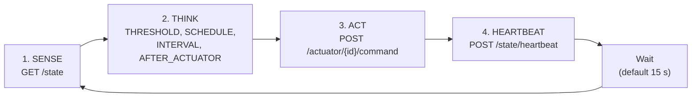

# Microcontroller API Client

The `microcontroller-api-client` repository is the GreenThumb controller: the `controller` service on the node.

## What It Is

One program, `main.py`, that runs a Sense-Think-Act loop in its own container. It is an HTTP client of `microcontroller-api` and nothing more: no database access and no hardware drivers. Actuator state comes from the device in every `/state` response, so the controller never commands anything without fresh state. If `/state` fails, the cycle is skipped.

```
microcontroller-api-client/
├── main.py
├── tests/
└── README.md
```

## The Loop



1. **Sense:** `GET /state` returns the readings, the control rules, the active phase and each actuator's real state.
2. **Think:** four passes evaluate the rules by trigger kind: `THRESHOLD`, `SCHEDULE`, `INTERVAL` and `AFTER_ACTUATOR`.
3. **Act:** one `POST /actuator/{id}/command` per decided action, with a body such as `{"action": "on"}`. An actuator held under manual override, or one that is not software-controllable, is never commanded.
4. **Heartbeat:** `POST /state/heartbeat` at the end of every cycle.

## Configuration

| Variable | Default | Description |
|----------|---------|-------------|
| `API_BASE_URL` | `http://api:8080` | Base URL of `microcontroller-api` |
| `LOG_LEVEL` | `INFO` | Log level |

Tuning is not set by environment variables. `control_interval_s` and `hysteresis_pct` are read from `GET /settings/runtime` at the start of every cycle.

## Tests

From the repository directory, in PowerShell:

```powershell
python -m pip install -r requirements.txt pytest
python -m pytest tests/
```

## Running

The controller starts with the rest of the node. On the Pi (Linux):

```bash
cd deploy && make up
make logs-controller
```

## Safety

If heartbeats stop, the API's watchdog enters safety mode and turns every actuator off, except those flagged `fail_safe`. See [Actuators](actuators.md#safety).

## Replacing the Controller

Any client that reads `/state`, commands `/actuator/{id}/command` and heartbeats can take its place.
