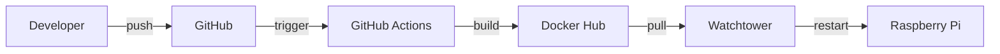

# CI/CD Pipeline

GreenThumb uses GitHub Actions for continuous integration and deployment.

## Overview



## Workflows

### rasp5: Build and Push

**File**: `.github/workflows/build.yml`

**Triggers**:
- Push to `main` branch
- Manual dispatch

**Steps**:

1. Checkout code
2. Set up QEMU (for ARM64 builds)
3. Set up Docker Buildx
4. Login to Docker Hub
5. Build and push `greenthumb-api`
6. Build and push `greenthumb-data-collection`

```yaml
name: Build and Push Docker Images

on:
  push:
    branches: [main]
  workflow_dispatch:

jobs:
  build:
    runs-on: ubuntu-latest
    steps:
      - uses: actions/checkout@v4
      
      - uses: docker/setup-qemu-action@v3
      
      - uses: docker/setup-buildx-action@v3
      
      - uses: docker/login-action@v3
        with:
          username: ${{ secrets.DOCKERHUB_USERNAME }}
          password: ${{ secrets.DOCKERHUB_TOKEN }}
      
      - uses: docker/build-push-action@v5
        with:
          context: ./fastapi
          platforms: linux/arm64
          push: true
          tags: ${{ secrets.DOCKERHUB_USERNAME }}/greenthumb-api:latest
          build-args: |
            GH_PAT=${{ secrets.GH_PAT }}
```

### docs: Deploy Documentation

**File**: `.github/workflows/deploy.yml`

**Triggers**:
- Push to `main` branch
- Manual dispatch

**Steps**:

1. Checkout code
2. Setup Python
3. Install MkDocs dependencies
4. Build documentation
5. Deploy to GitHub Pages

## Required Secrets

### Repository Secrets (rasp5)

| Secret | Description |
|--------|-------------|
| `DOCKERHUB_USERNAME` | Docker Hub username |
| `DOCKERHUB_TOKEN` | Docker Hub access token |
| `GH_PAT` | GitHub PAT for private repos |

### How to Add Secrets

1. Go to repository Settings
2. Click "Secrets and variables" > "Actions"
3. Click "New repository secret"
4. Enter name and value

## Automatic Updates

### Watchtower

Watchtower runs on the Raspberry Pi and automatically:

1. Polls Docker Hub every 5 minutes
2. Pulls new images when available
3. Restarts containers with new images
4. Cleans up old images

**Configuration** (in `compose.yaml`):

```yaml
watchtower:
  image: containrrr/watchtower
  restart: unless-stopped
  volumes:
    - /var/run/docker.sock:/var/run/docker.sock
  environment:
    WATCHTOWER_POLL_INTERVAL: 300
    WATCHTOWER_CLEANUP: "true"
```

## Deployment Flow

1. **Developer pushes to main**
   ```bash
   git push origin main
   ```

2. **GitHub Actions builds**
   - ~5-10 minutes for ARM64 build
   - Images pushed to Docker Hub

3. **Watchtower detects update**
   - Checks every 5 minutes
   - Pulls new images

4. **Containers restart**
   - Zero-downtime for api/data_collection
   - Database persists data

## Monitoring

### Check Build Status

- Go to repository > Actions tab
- View workflow runs and logs

### Check Deployment Status

```bash
# On Raspberry Pi
docker compose ps
docker compose logs watchtower
```

### Verify New Version

```bash
docker images
# Check image creation date
```

## Troubleshooting

### Build Fails

- Check GitHub Actions logs
- Verify secrets are set correctly
- Ensure Dockerfile is valid

### Watchtower Not Updating

```bash
# Check watchtower logs
docker compose logs watchtower

# Force pull
docker compose pull
docker compose up -d
```

### ARM64 Build Issues

- Ensure QEMU is set up
- Check platform is `linux/arm64`
- Verify base image supports ARM64
