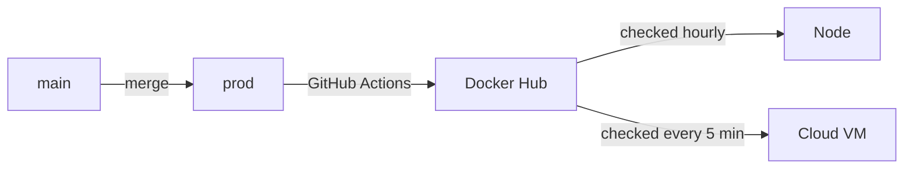

# CI/CD Pipeline

GreenThumb uses GitHub Actions to test the shared package, build Docker images and publish this site.

## Branches

- Work lands on `main`.
- Merging into `prod` builds the images, and the devices run what `prod` built.
- This documentation site publishes from `main`.

```mermaid
graph LR
    MAIN[main] -->|merge| PROD[prod]
    PROD -->|GitHub Actions| HUB[Docker Hub]
    HUB -->|checked hourly| NODE[Node]
    HUB -->|checked every 5 min| VM[Cloud VM]
```

## Workflows

| Repository | Workflow | Runs on | What it does |
|------------|----------|---------|--------------|
| `rasp5` | `.github/workflows/build.yml` | push to `prod`, manual dispatch | Builds 3 `linux/arm64` images: `microcontroller-api`, `microcontroller-api-client`, `local-dashboard`. The `greenthumb-models` tests gate the API image. A models change also bumps the cloud's models pin, and the bump is refused when the sync contract version changes. |
| `greenthumb-cloud` | `.github/workflows/cloud-images.yml` | push to `prod`, manual dispatch | Builds 6 `linux/amd64` images: `greenthumb-gateway`, `greenthumb-cloud-api`, `greenthumb-auth-service`, `greenthumb-account-service`, `greenthumb-admin-dashboard`, `greenthumb-landing`. |
| `greenthumb-models` | `.github/workflows/tests.yml` | every push and pull request | Runs the shared package's test suite. |
| `docs` | `.github/workflows/deploy.yml` | push to `main`, manual dispatch | Builds this site with MkDocs and deploys it to GitHub Pages. |

Both image workflows rebuild only the images whose code changed. A manual dispatch builds all of them, and it refuses to run from any branch but `prod`.

## Image tags

Every image is tagged `:prod` and `:<short-sha>` (the short commit SHA of the build). The stacks run `:prod` by default.

To pin or roll back a release, set `IMAGE_TAG=<short-sha>` in the deployment's `.env` and bring the stack up again.

## Automatic updates (Watchtower)

| Host | Checks | Updated automatically | Updated by hand |
|------|--------|-----------------------|-----------------|
| Node (Raspberry Pi) | hourly | `local-dashboard` | `api` and `controller`: `make pull`, then `make promote` |
| Cloud VM | every 5 minutes | `dashboard` and `landing` | `gateway`, `greenthumb-api`, `auth-service`, `account-service`: `make promote` |

The node's `api` and `controller` drive hardware, so they are never replaced unattended. Recreating `api` can switch relays, so promote it with the rig in view.

## Required Secrets

### Repository Secrets (rasp5 and greenthumb-cloud)

| Secret | Description |
|--------|-------------|
| `DOCKERHUB_USERNAME` | Docker Hub username |
| `DOCKERHUB_TOKEN` | Docker Hub access token |
| `GH_PAT` | GitHub PAT for private repos |

### How to Add Secrets

1. Go to repository Settings
2. Click "Secrets and variables" > "Actions"
3. Click "New repository secret"
4. Enter name and value

## Troubleshooting

- **A build failed or did not start:** open the repository's **Actions** tab and read the run's logs. Check that the push went to `prod` and that the secrets are set.
- **The node still runs an old version:** on the Pi, from `deploy/`, run `make pull`, then `make promote`.
- **The cloud still runs an old version:** on the VM, from `deploy/`, run `make promote`.

## Related

- [Contributing](contributing.md) - Branches and commit messages
- [Local Setup](local-setup.md) - Development environment
