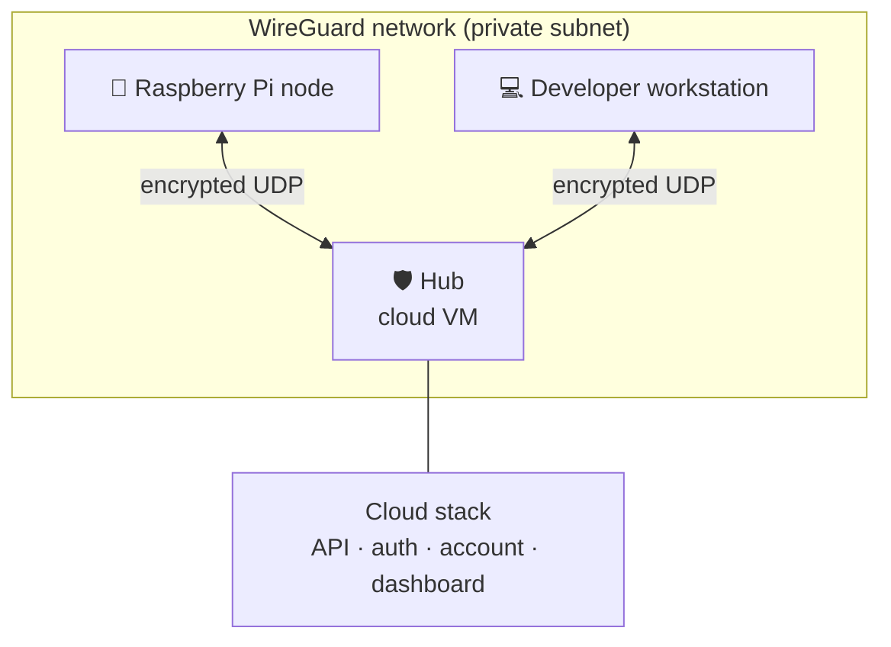

# Remote Access (WireGuard)

How a Raspberry Pi node and a developer workstation reach each other, and reach the cloud stack, without
exposing anything to the public internet.

!!! info "This replaces the old Tailscale guide"
    GreenThumb ran on Tailscale during early development. It was decommissioned in July 2026 in favour of
    a self-hosted WireGuard hub. The reasoning: one less third-party dependency in the path between a
    grower's node and their data, no external coordination server, and no account tier to outgrow.

## Topology

A **hub-and-spoke** network. One always-on VM acts as the hub; every other machine is a spoke that dials
in to it. Spokes reach each other through the hub.



Only the hub has a public address, and only its WireGuard port is reachable. The Pi needs no port
forwarding, no static IP and no inbound firewall rule, which is what makes a node deployable on a
domestic connection behind NAT.

## What is reachable, and what is not

| Surface | Reachable from | Notes |
|---|---|---|
| Landing page | Public internet | Static site, ports 80/443 |
| Cloud API and admin dashboard | VPN only | Public routes are deliberately not served |
| Pi local dashboard and API | VPN only | By construction, no auth on the Pi API |
| SSH to the Pi | VPN only | Key-based, over the VPN address |

!!! warning "The Pi API has no authentication"
    That is acceptable precisely because it is only reachable inside the VPN. Do not expose it. Bearer
    tokens are required before any node is reachable by an external user.

## Enrolling a node

Unlike Tailscale, WireGuard has no auth key and no signup step. Enrolment is a one-time exchange of
public keys, done deliberately on both ends.

### 1. Install on the Pi

```bash
sudo apt update
sudo apt install -y wireguard
```

### 2. Generate the node's key pair

```bash
wg genkey | sudo tee /etc/wireguard/privatekey | wg pubkey | sudo tee /etc/wireguard/publickey
sudo chmod 600 /etc/wireguard/privatekey
```

The private key never leaves the Pi. Send the **public** key to whoever administers the hub.

### 3. Write the node's config

`/etc/wireguard/wg0.conf`:

```ini
[Interface]
PrivateKey = <this node's private key>
Address    = <the address the hub assigned you>/24

[Peer]
PublicKey           = <the hub's public key>
Endpoint            = <hub host>:<hub port>
AllowedIPs          = <VPN subnet>/24
PersistentKeepalive = 25
```

!!! danger "`PersistentKeepalive = 25` is not optional for a node"
    Without it, the node's NAT mapping expires as soon as it goes quiet, and the hub can no longer
    initiate a handshake inward. During a real outage this is the difference between being able to probe
    a node and being able only to observe that its last handshake is stale. Set it on every node.

### 4. Bring it up

```bash
sudo systemctl enable --now wg-quick@wg0
sudo wg show                     # confirm a recent handshake
ping -c3 <hub VPN address>
```

The hub side must add the node as a peer with the same public key and address before the handshake
succeeds. That is an administrative step, not a self-service one, and it is intentional.

## Checking a link

```bash
sudo wg show wg0 latest-handshakes    # seconds since each peer was last heard from
sudo wg show wg0 transfer             # bytes in/out per peer
```

A `latest-handshake` older than roughly 180 seconds means the peer is effectively offline. This is the
signal the fleet's online/offline heartbeat is built on.

!!! tip "A stale handshake is not the same as a dead node"
    A node that loses its uplink keeps collecting and buffering measurements locally, and flushes them
    when the link returns. Loss of connectivity costs latency, not data. See
    [Architecture Overview](../architecture/overview.md).

## Troubleshooting

| Symptom | Likely cause |
|---|---|
| No handshake at all | Wrong public key on one side, or the hub's UDP port is not reachable |
| Handshake succeeds, no traffic passes | `AllowedIPs` too narrow, or an address collision on the subnet |
| Works, then goes quiet after a few minutes | Missing `PersistentKeepalive` on the node |
| Works on Wi-Fi, not after reboot | `wg-quick@wg0` not enabled, so the tunnel never comes up unattended |
| Node unreachable but its own logs look healthy | Check the node's uplink first. The VPN cannot fix a link that is down beneath it |
