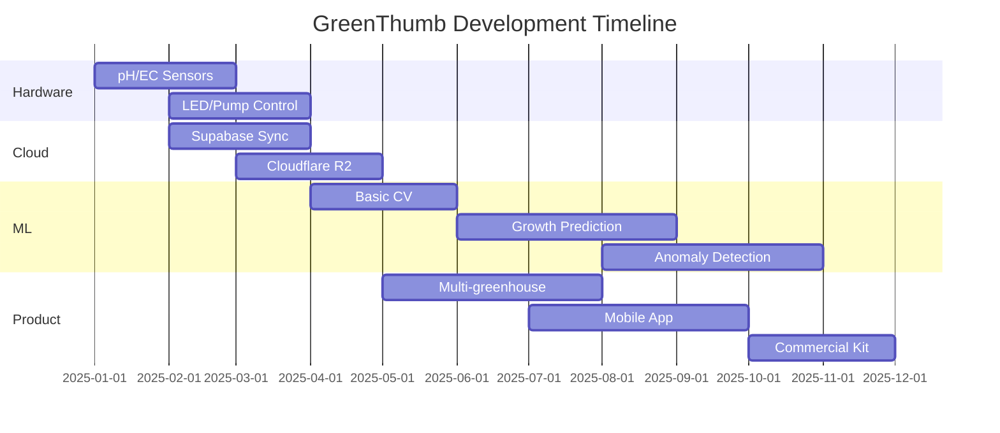

# Future Work

This document outlines the planned features and improvements for the GreenThumb project.

## Short-term (Next 3 Months)

### Hardware Integration

- [ ] **pH Sensor Integration**
    - Add pH sensor to monitor nutrient solution acidity
    - Target range: 5.5-6.5 for hydroponics
    
- [ ] **EC Sensor Integration**
    - Add electrical conductivity sensor
    - Monitor nutrient concentration
    - Target range: 1.5-2.5 dS/m

- [ ] **LED Control**
    - Full-spectrum LED panel integration
    - PWM control for light intensity
    - Automated photoperiod management

- [ ] **Water Pump Control**
    - PWM-controlled circulation pump
    - Automated nutrient delivery

### Software Development

- [ ] **Cloud Database Sync**
    - Daily sync to Supabase PostgreSQL
    - Handle offline-first with eventual consistency
    
- [ ] **Image Storage**
    - Upload photos to Cloudflare R2
    - Optimize storage costs
    
- [ ] **Computer Vision (Basic)**
    - Plant detection in images
    - Leaf area estimation
    - Color analysis for health monitoring

## Medium-term (3-6 Months)

### Multiple Greenhouse Support

- [ ] **Device Registration System**
    - Register multiple Raspberry Pi devices
    - Central management dashboard
    
- [ ] **Fleet Management**
    - Monitor all greenhouses from single interface
    - Aggregate data visualization

### Machine Learning

- [ ] **Growth Prediction**
    - Train models on collected data
    - Predict harvest time based on conditions
    
- [ ] **Anomaly Detection**
    - Detect unusual sensor readings
    - Alert on potential problems

- [ ] **Optimal Condition Discovery**
    - Identify best conditions for each plant species
    - Recommend adjustments

### Mobile Application

- [ ] **React Native App**
    - Real-time monitoring
    - Push notifications
    - Remote control

## Long-term (6-12 Months)

### Advanced Features

- [ ] **Robotic Harvesting**
    - Computer vision for fruit detection
    - Robotic arm integration
    
- [ ] **Dynamic Glass Control**
    - Electrochromic glass for light filtering
    - Automated transparency adjustment

- [ ] **3D Growth Visualization**
    - Photogrammetry from multiple angles
    - Growth timeline visualization

### Commercialization

- [ ] **Product Development**
    - Standardized hardware kit
    - Easy assembly instructions
    - Pre-configured software images
    
- [ ] **SaaS Platform**
    - Cloud dashboard for customers
    - Data analytics as a service
    - ML model access

### Research & Publications

- [ ] **Research Paper**
    - Publish findings on growth optimization
    - Open data sets for community
    
- [ ] **Open Source Release**
    - Complete documentation
    - Hardware schematics
    - Bill of materials

## Technology Roadmap

## Contributing

We welcome contributions! See our [Contributing Guide](../development/contributing.md) for details.

---

*Last updated: December 2025*
