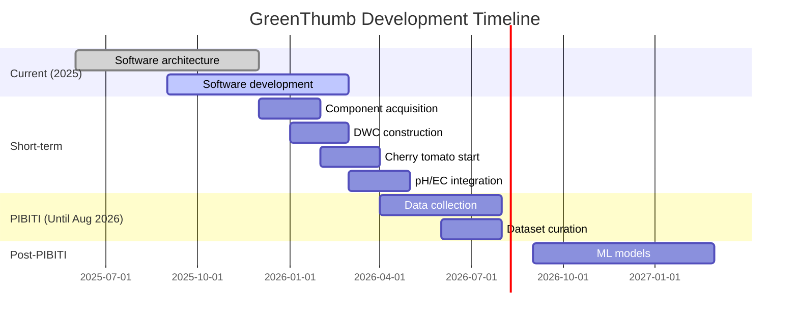

# Future Work

This document outlines the planned features and improvements for the GreenThumb project.

## Short-term (Current Phase)

### Physical Construction

- [ ] **DWC Greenhouse Construction**
    - Build the physical Deep Water Culture greenhouse
    - Install aeration system (air pumps, air stones)
    - Set up reservoir and growing stations

- [ ] **Cherry Tomato Cultivation**
    - Start cherry tomato cultivation for data collection
    - Establish baseline growth metrics
    - Document environmental conditions

### Hardware Integration

- [ ] **pH Sensor Integration**
    - Add pH sensor to monitor nutrient solution acidity
    - Target range: 5.5-6.5 for hydroponics
    
- [ ] **EC Sensor Integration**
    - Add electrical conductivity sensor
    - Monitor nutrient concentration
    - Target range: 1.5-2.5 dS/m

- [ ] **LED Control**
    - Full-spectrum LED panel integration
    - PWM control for light intensity
    - Automated photoperiod management

- [ ] **Water Pump Control**
    - PWM-controlled circulation pump
    - Automated nutrient delivery

### Software Development

- [ ] **Cloud Database Sync**
    - Daily sync to Supabase PostgreSQL
    - Handle offline-first with eventual consistency
    
- [ ] **Image Storage**
    - Upload photos to Cloudflare R2
    - Optimize storage costs
    
- [ ] **Computer Vision (Basic)**
    - Plant detection in images
    - Leaf area estimation
    - Color analysis for health monitoring

## Medium-term (Until August 2026 - PIBITI End)

!!! info "Research Focus"
    The primary goal during the PIBITI period is **consistent and precise data collection** for future machine learning models.

### Data Collection

- [ ] **Reliable Sensor Data**
    - Continuous environmental monitoring
    - Automated data validation
    - High data quality standards

- [ ] **Image Dataset**
    - Systematic photo collection
    - Consistent lighting and angles
    - Proper labeling and metadata

### Machine Learning Preparation

- [ ] **Dataset Curation**
    - Clean and organize collected data
    - Create training/validation splits
    - Document data characteristics

- [ ] **Initial Model Experiments**
    - Prototype growth prediction models
    - Test anomaly detection approaches
    - Validate optimal conditions patterns

## Long-term (After PIBITI)

### Fleet Management

- [ ] **Device Registration System**
    - Register multiple Raspberry Pi devices
    - Central management dashboard
    
- [ ] **Multi-Greenhouse Support**
    - Monitor multiple greenhouses from single interface
    - Aggregate data visualization

### Mobile Application

- [ ] **React Native App**
    - Real-time monitoring
    - Push notifications
    - Remote control

### Machine Learning

- [ ] **Growth Prediction**
    - Train models on collected PIBITI data
    - Predict harvest time based on conditions
    
- [ ] **Anomaly Detection**
    - Detect unusual sensor readings
    - Alert on potential problems

- [ ] **Optimal Condition Discovery**
    - Identify best conditions for each plant species
    - Automated recommendations

### Research & Publications

- [ ] **Research Paper**
    - Publish findings on growth optimization
    - Share insights from PIBITI data

## Project Timeline

---

*Last updated: December 2025*
