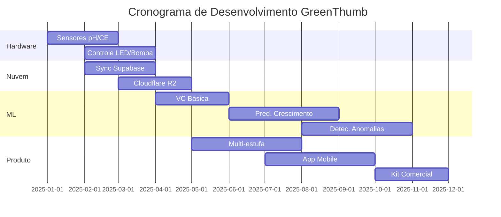

# Trabalhos Futuros

Este documento descreve os recursos e melhorias planejados para o projeto GreenThumb.

## Curto Prazo (Próximos 3 Meses)

### Integração de Hardware

- [ ] **Integração do Sensor de pH**
    - Adicionar sensor de pH para monitorar acidez da solução nutritiva
    - Faixa alvo: 5.5-6.5 para hidroponia
    
- [ ] **Integração do Sensor de CE**
    - Adicionar sensor de condutividade elétrica
    - Monitorar concentração de nutrientes
    - Faixa alvo: 1.5-2.5 dS/m

- [ ] **Controle de LEDs**
    - Integração de painel LED full-spectrum
    - Controle PWM para intensidade luminosa
    - Gerenciamento automático do fotoperíodo

- [ ] **Controle da Bomba d'Água**
    - Bomba de circulação controlada por PWM
    - Entrega automatizada de nutrientes

### Desenvolvimento de Software

- [ ] **Sincronização com Banco de Dados na Nuvem**
    - Sincronização diária com Supabase PostgreSQL
    - Funcionamento offline-first com consistência eventual
    
- [ ] **Armazenamento de Imagens**
    - Upload de fotos para Cloudflare R2
    - Otimização de custos de armazenamento
    
- [ ] **Visão Computacional (Básica)**
    - Detecção de plantas nas imagens
    - Estimativa de área foliar
    - Análise de cor para monitoramento de saúde

## Médio Prazo (3-6 Meses)

### Suporte a Múltiplas Estufas

- [ ] **Sistema de Registro de Dispositivos**
    - Registrar múltiplos dispositivos Raspberry Pi
    - Dashboard de gerenciamento centralizado
    
- [ ] **Gerenciamento de Frota**
    - Monitorar todas as estufas em uma única interface
    - Visualização agregada de dados

### Machine Learning

- [ ] **Predição de Crescimento**
    - Treinar modelos com dados coletados
    - Prever tempo de colheita baseado nas condições
    
- [ ] **Detecção de Anomalias**
    - Detectar leituras incomuns de sensores
    - Alertar sobre potenciais problemas

- [ ] **Descoberta de Condições Ótimas**
    - Identificar melhores condições para cada espécie
    - Recomendar ajustes

### Aplicativo Mobile

- [ ] **App React Native**
    - Monitoramento em tempo real
    - Notificações push
    - Controle remoto

## Longo Prazo (6-12 Meses)

### Recursos Avançados

- [ ] **Colheita Robótica**
    - Visão computacional para detecção de frutos
    - Integração de braço robótico
    
- [ ] **Controle de Vidro Dinâmico**
    - Vidro eletrocrômico para filtragem de luz
    - Ajuste automático de transparência

- [ ] **Visualização 3D do Crescimento**
    - Fotogrametria de múltiplos ângulos
    - Visualização de linha do tempo de crescimento

### Comercialização

- [ ] **Desenvolvimento de Produto**
    - Kit de hardware padronizado
    - Instruções de montagem simplificadas
    - Imagens de software pré-configuradas
    
- [ ] **Plataforma SaaS**
    - Dashboard em nuvem para clientes
    - Análise de dados como serviço
    - Acesso a modelos de ML

### Pesquisa & Publicações

- [ ] **Artigo Científico**
    - Publicar descobertas sobre otimização de crescimento
    - Conjuntos de dados abertos para a comunidade
    
- [ ] **Lançamento Open Source**
    - Documentação completa
    - Esquemáticos de hardware
    - Lista de materiais

## Cronograma de Desenvolvimento

## Contribuindo

Contribuições são bem-vindas! Veja nosso [Guia de Contribuição](../development/contributing.md) para detalhes.

---

*Última atualização: Dezembro de 2025*
