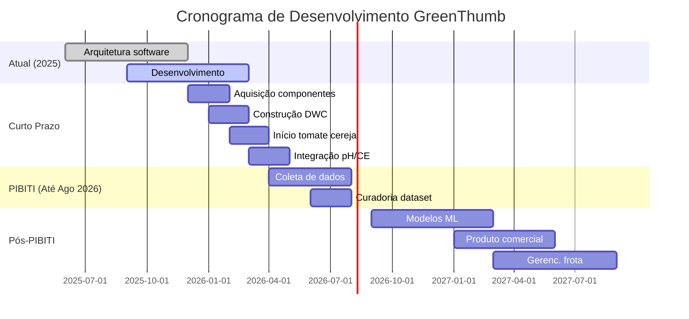

# Trabalhos Futuros

Este documento descreve os recursos e melhorias planejados para o projeto GreenThumb.

## Curto Prazo (Fase Atual)

### Construção Física

- [ ] **Construção da Estufa DWC**
    - Construir a estufa física com Deep Water Culture
    - Instalar sistema de aeração (bombas de ar, pedras porosas)
    - Configurar reservatório e estações de cultivo

- [ ] **Cultivo de Tomate Cereja**
    - Iniciar cultivo de tomate cereja para coleta de dados
    - Estabelecer métricas de crescimento base
    - Documentar condições ambientais

### Integração de Hardware

- [ ] **Integração do Sensor de pH**
    - Adicionar sensor de pH para monitorar acidez da solução nutritiva
    - Faixa alvo: 5.5-6.5 para hidroponia
    
- [ ] **Integração do Sensor de CE**
    - Adicionar sensor de condutividade elétrica
    - Monitorar concentração de nutrientes
    - Faixa alvo: 1.5-2.5 dS/m

- [ ] **Controle de LEDs**
    - Integração de painel LED full-spectrum
    - Controle PWM para intensidade luminosa
    - Gerenciamento automático do fotoperíodo

- [ ] **Controle da Bomba d'Água**
    - Bomba de circulação controlada por PWM
    - Entrega automatizada de nutrientes

### Desenvolvimento de Software

- [ ] **Sincronização com Banco de Dados na Nuvem**
    - Sincronização diária com Supabase PostgreSQL
    - Funcionamento offline-first com consistência eventual
    
- [ ] **Armazenamento de Imagens**
    - Upload de fotos para Cloudflare R2
    - Otimização de custos de armazenamento
    
- [ ] **Visão Computacional (Básica)**
    - Detecção de plantas nas imagens
    - Estimativa de área foliar
    - Análise de cor para monitoramento de saúde

## Médio Prazo (Até Agosto de 2026 - Fim do PIBITI)

!!! info "Foco da Pesquisa"
    O objetivo principal durante o período do PIBITI é a **coleta de dados consistente e precisa** para futuros modelos de machine learning.

### Coleta de Dados

- [ ] **Dados de Sensores Confiáveis**
    - Monitoramento ambiental contínuo
    - Validação automática de dados
    - Padrões de alta qualidade de dados

- [ ] **Dataset de Imagens**
    - Coleta sistemática de fotos
    - Iluminação e ângulos consistentes
    - Rotulação adequada e metadados

### Preparação para Machine Learning

- [ ] **Curadoria do Dataset**
    - Limpar e organizar dados coletados
    - Criar divisões de treino/validação
    - Documentar características dos dados

- [ ] **Experimentos Iniciais de Modelos**
    - Prototipar modelos de predição de crescimento
    - Testar abordagens de detecção de anomalias
    - Validar padrões de condições ótimas

## Longo Prazo (Após PIBITI)

### Desenvolvimento de Produto

- [ ] **Produto Comercial**
    - Criar kit de estufa vendável
    - Componentes de hardware padronizados
    - Instruções de montagem simplificadas
    - Imagens de software pré-configuradas

### Gerenciamento de Frota

- [ ] **Sistema de Registro de Dispositivos**
    - Registrar múltiplos dispositivos Raspberry Pi
    - Dashboard de gerenciamento centralizado
    
- [ ] **Suporte a Múltiplas Estufas**
    - Monitorar múltiplas estufas em uma única interface
    - Visualização agregada de dados

### Aplicativo Mobile

- [ ] **App React Native**
    - Monitoramento em tempo real
    - Notificações push
    - Controle remoto

### Machine Learning

- [ ] **Predição de Crescimento**
    - Treinar modelos com dados do PIBITI
    - Prever tempo de colheita baseado nas condições
    
- [ ] **Detecção de Anomalias**
    - Detectar leituras incomuns de sensores
    - Alertar sobre potenciais problemas

- [ ] **Descoberta de Condições Ótimas**
    - Identificar melhores condições para cada espécie
    - Recomendações automatizadas

### Pesquisa & Publicações

- [ ] **Artigo Científico**
    - Publicar descobertas sobre otimização de crescimento
    - Compartilhar insights dos dados do PIBITI

## Cronograma do Projeto

---

*Última atualização: Dezembro de 2025*
